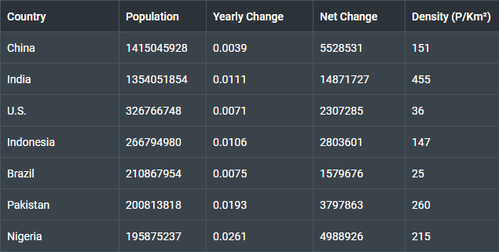
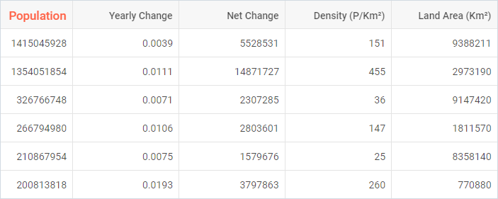
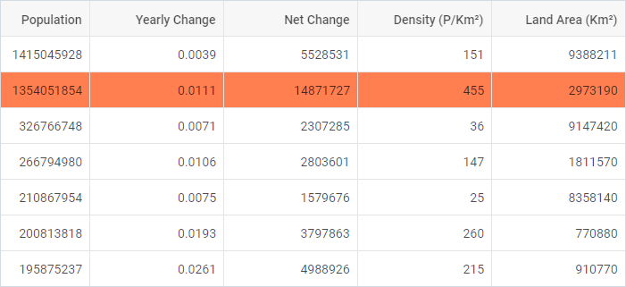
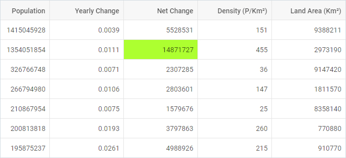
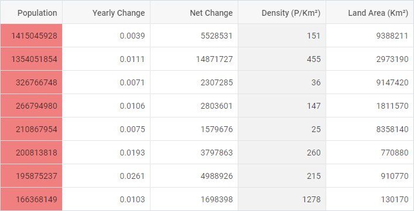
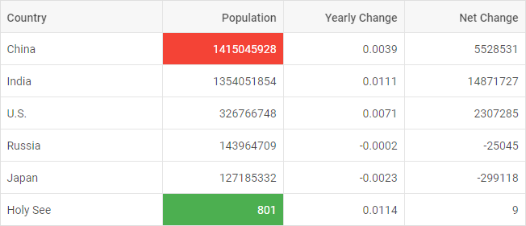
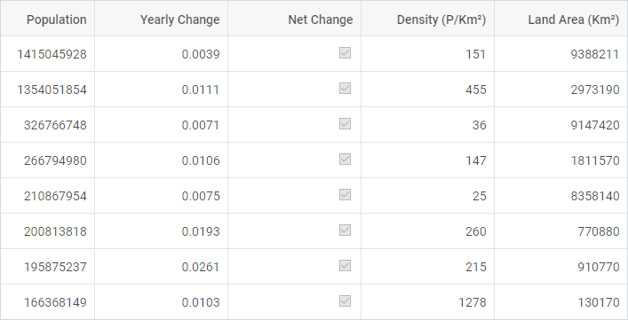

---
sidebar_label: Customization
title: Customization
description: description
---          

Styling grid
----------------

There is a possibility to make changes in the look and feel of a grid. 

{{editor    https://snippet.dhtmlx.com/xs7bixmg	Grid. Styling Selection}}

For this you need to take the following steps:

- add a new CSS class(es) with desired settings in the &lt;style&gt; section of your HTML page or in your file with styles (don't forget to include your file on the page in this case)

~~~html

~~~

- specify the name of the created CSS class (or names of classes separated by spaces) as the value of the [css](grid/api/grid_css_config.md) property in the Grid configuration:

~~~js
var grid = new dhx.Grid({ 
    css:"my-first-class my-second-class"
});
~~~

{{editor    https://snippet.dhtmlx.com/c5tr3s5r	Grid. Styling Grid}}

Styling header cells
-------------------

You can easily set some styling to the text of header cells by applying some inline style or a CSS class to the **text** property of the header of a column:

~~~html

~~~

~~~js
var grid = new dhx.Grid("grid", {
	columns: [
	  { width: 200, id: "country", 
      	header: [{ text: "Country" }] },
      { width: 150, id: "population", 
      	header: [{ text: "Population" }] },
      { width: 150, id: "yearlyChange", header: [{ text: "Yearly Change" }] },
      { width: 150, id: "netChange", header: [{ text: "Net Change" }] },
      { width: 150, id: "destiny", header: [{ text: "Density (P/Km²)" }] },
      { width: 150, id: "area", header: [{ text: "Land Area (Km²)" }] },
	],
	data: dataset
});
~~~

{{editor    https://snippet.dhtmlx.com/7o4elf48	Grid. Styling Header Cells}}

Styling footer cells
-------------------

You can easily set some styling to the text of footer cells by applying some inline style or a CSS class to the **text** property of the footer of a column:

~~~html

~~~

~~~js
var grid = new dhx.Grid("grid", {
	columns: [
	  {
		width: 100, id: "a", header: [{ text: "#" }], footer: [
			{ text: '
Total
', colspan: 3 },
			{ text: '
Minimal value
', colspan: 3 }
		]
      },
	  { width: 100, id: "b", header: [{ text: "Title" }] },
	  { width: 200, id: "c", header: [{ text: "Order" }] },
	  { width: 200, id: "d", header: [{ text: "Price" }], footer: [
      		{ content: "sum" }, { content: "min" }        
      	] 
      }
	],
	data: dataset
});
~~~

{{editor    https://snippet.dhtmlx.com/d254hcvp	Grid. Styling Footer Cells}}

Styling rows
---------------

It is possible to change the appearance of grid rows by applying custom CSS styles to them. There are two ways to do it:

- via the **rowCss** property in the configuration of Grid. As a value of property set a function that takes the id of a row as a parameter and returns a string with the name of a CSS class.

~~~html

~~~

~~~js
var grid = new dhx.Grid("grid", {
	columns: [// columns config],
	rowCss: function (row) { return row.custom ? "my_custom_row" : "" }, /*!*/
	data: dataset
});
~~~

{{editor    https://snippet.dhtmlx.com/2dxtwf9n	Grid. Custom Row Style}}

- with the help of the **addRowCss()** method:

~~~html

~~~

~~~js
var rowId = grid.data.getId(1);
grid.addRowCss(rowId, "myCustomClass"); /*!*/
~~~

{{editor    https://snippet.dhtmlx.com/idvmge2d	Grid. Add Row Css}}

where:

<table class="webixdoc_links">
	<tbody>
        <tr>
			<td class="webixdoc_links0"><b>rowId</b></td>
			<td>(<i>string,number</i>) the id of a row</td>
		</tr>
		<tr>
			<td class="webixdoc_links0"><b>css</b></td>
			<td>(<i>string</i>) the name of a CSS class</td>
		</tr>
    </tbody>
</table>

Styling cells
----------------

It is easy to style necessary cells using the **addCellCss()** method. It takes three parameters:

<table class="webixdoc_links">
	<tbody>
        <tr>
			<td class="webixdoc_links0"><b>row</b></td>
			<td>(<i>string,number</i>) the id of a row</td>
		</tr>
		<tr>
			<td class="webixdoc_links0"><b>col</b></td>
			<td>(<i>string,number</i>) the id of a column</td>
		</tr>
		<tr>
			<td class="webixdoc_links0"><b>css</b></td>
			<td>(<i>string</i>) the name of the CSS class</td>
		</tr>
    </tbody>
</table>

~~~html

~~~

~~~js
grid.addCellCss(rowId, "netChange", "myCustomClass");
~~~

{{editor    https://snippet.dhtmlx.com/hskmp8rh	Grid. Add Cell Css}}

Adding custom marks to cells
-------------------

You can mark particular cells in a grid using the **mark** property of a column configuration. You need to set its value as a function that takes the following parameters:

<table class="webixdoc_links">
	<tbody>
        <tr>
			<td class="webixdoc_links0"><b>cell</b></td>
			<td>(<i>string</i>) the value of a cell</td>
		</tr>
		<tr>
			<td class="webixdoc_links0"><b>columnCells</b></td>
			<td>(<i>array</i>) an array of all cell values in the specified column</td>
		</tr>
		<tr>
			<td class="webixdoc_links0"><b>row</b></td>
			<td>(<i>object</i>) an object with all cells in a row</td>
		</tr>
		<tr>
			<td class="webixdoc_links0"><b>col</b></td>
			<td>(<i>object</i>) the config of a column (see the columns config)</td>
		</tr>
    </tbody>
</table>

The function should return a string with a custom CSS class for your mark.

~~~html

~~~

~~~js
var grid = new dhx.Grid("grid", {
	columns: [
		{
			width: 150, id: "population", header: [{ text: "Population" }],
			// marks specified cells in a column
			mark: function (cell, data, row, col) { /*!*/
				return cell > 100000000 ? "my_custom_mark" : "" /*!*/
			}
		}, 
		{
			width: 150, id: "destiny", header: [{ text: "Density (P/Km²)" }],
			// marks all cells in a column
			mark: function (cell, data) { return "total_col"; } /*!*/
		},
	],
	data: dataset
});
~~~

[Grid. Custom Mark Cells](https://snippet.dhtmlx.com/9whjve0v)

It is also possible to highlight cells with minimum and (or) maximum values in a grid using the **mark** property of a column configuration. The property is an object which takes two optional parameters:

<table class="webixdoc_links">
	<tbody>
        <tr>
			<td class="webixdoc_links0"><b>min</b></td>
			<td>(<i>string</i>) a custom CSS class to mark a cell that contains the minimum value</td>
		</tr>
		<tr>
			<td class="webixdoc_links0"><b>max</b></td>
			<td>(<i>string</i>) a custom CSS class to mark a cell that contains the maximum value</td>
		</tr>
    </tbody>
</table>
 

~~~html

~~~

~~~js
var grid = new dhx.Grid("grid", {
	columns: [
		{ width: 200, id: "country", header: [{ text: "Country" }] },
		{
			width: 150, id: "population", header: [{ text: "Population" }],
			mark: {
				min: "min_cell", /*!*/
				max: "max_cell" /*!*/
			}
		},
		// more options
	],
	data: dataset
});
~~~

{{editor    https://snippet.dhtmlx.com/buirf16n	Grid. Mark Cells}}

Adding template to cells
-----------------------------

It is possible to customize the content of cells of Grid via the **template** property of a [column configuration](grid/configuration.md#columns). The template option is a function that takes three parameters:

<table class="webixdoc_links">
	<tbody>
        <tr>
			<td class="webixdoc_links0"><b>cellValue</b></td>
			<td>(<i>any</i>) the value of a cell</td>
		</tr>
		<tr>
			<td class="webixdoc_links0"><b>row</b></td>
			<td>(<i>object</i>) an object with all cells in a row</td>
		</tr>
		<tr>
			<td class="webixdoc_links0"><b>col</b></td>
			<td>(<i>object</i>) the config of a column</td>
		</tr>
    </tbody>
</table>
 

~~~js
var grid = new dhx.Grid("grid", {
	columns: [
		{ width: 200, id: "country", header: [{text: "Country"}] },
		{ width: 150, id: "population", header: [{text: "Population"}] },
		{ width: 150, id: "netChange", header: [{text: "Net Change"}],
		  htmlEnable: true,
		  template: function (text, row, col) { /*!*/
			return "<input type=\"checkbox\" " + (text > 300000 ? "checked": "")  + ">"; /*!*/
		  }
		}
	],
	data: dataset
});
~~~

{{editor    https://snippet.dhtmlx.com/9txizaow	Grid. Cell Templates}}

<h3 id="eventhandling">Event handlers for the template</h3>

Starting from v7.0, you can assign event handlers to HTML elements of a custom template of Grid cells via using the  configuration property of Grid, for instance:

~~~js
const grid = new dhx.Grid("grid", {
	columns: [
		{ width: 200, id: "country", header: [{ text: "Country" }], htmlEnable: true },
		{ width: 150, id: "netChange", header: [{text: "Net Change"}],
			htmlEnable: true,
			tooltip: false,
			template: function (text, row, col) { /*!*/
				return "
<input type='checkbox'  /*!*/
                    disabled " + (text > 3000000 ? "checked" : "") + " >
"; /*!*/
			} /*!*/
		},
        // more options
    ],
	data: data,
	eventHandlers: { /*!*/
		onmouseover: { /*!*/
			cell__template: function(event, data) { /*!*/
				display(JSON.stringify(data.row, null, 2)); /*!*/
			} /*!*/
	    } /*!*/
    } /*!*/
});
~~~

[Grid. Handling events in template](https://snippet.dhtmlx.com/zcv5drxc)

The **eventHandlers** object includes a set of *key:value* pairs, where:

<table class="webixdoc_links">
	<tbody>
        <tr>
			<td class="webixdoc_links0"><i>key</i></td>
			<td> the name of the event. Note, that at the beginning of the event name the <b>'on'</b> prefix is used (onclick, onmouseover).</td>
		</tr>
        <tr>
			<td class="webixdoc_links0"><i>value</i></td>
			<td>an object that contains a <i>key:value</i> pair, where <i>key</i> is the css class name that the handler will be applied to and <i>value</i> is a function that takes two parameters:
            <ul>
                <li><b>event</b> - an event object</li>
                <li><b>object</b> - an object with two attributes:
                <ol>- <b>row</b> - an object with a row configuration</ol>
                <ol>- <b>column</b> - an object with a column configuration</ol></li>
            </ul></td>
		</tr>
    </tbody>
</table>
