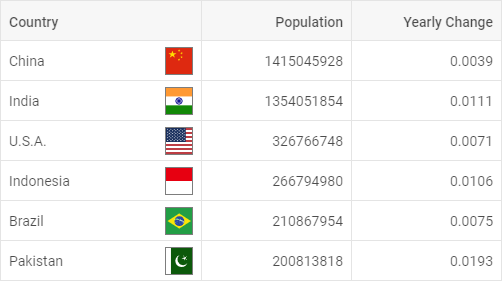

---
sidebar_label: Overview
title: Grid overview
description: DHTMLX Grid is a smart JavaScript component for presenting data in a tabular way. Complete API provides a lot of versatile features, e.g. sorting columns, keyboard navigation, styling cells, drag-n-drop of rows and columns, etc.
---          

dhtmlxGrid is a flexible, smart, and easy-to-use JavaScript component which allows creating tables with fixed multi-line headers and footers, sortable columns, 
built-in filtering, and other useful features. dhtmlxGrid provides great possibilities for customizing its look and feel. Complete JavaScript API is provided to help users save time on configuring.

Check [online samples for dhtmlxGrid](https://docs.dhtmlx.com/suite/samples/grid/).  

## API Reference

- 

## Related resources

- To get just dhtmlxGrid, download it from [our website](https://dhtmlx.com/docs/products/dhtmlxGrid/download.shtml)
- To get the whole JavaScript library of UI components [download dhtmlxSuite](https://dhtmlx.com/docs/products/dhtmlxSuite/download.shtml)          
- There are also [online samples for dhtmlxGrid](https://docs.dhtmlx.com/suite/samples/grid/)  

## Guides

Says how to build a standard grid on a page and bring it to life: configure with specific settings, customize the appearance, attach events, etc.

- 
- 
- 
- 
- 
- 
- 

## Other

- 
