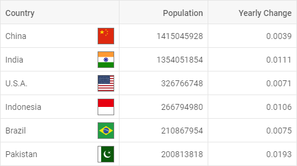

# Grid overview

DHTMLX Grid is a flexible, smart, and easy-to-use JavaScript component which allows creating tables with fixed multi-line headers and footers, sortable columns, built-in filtering, and other useful features. DHTMLX Grid provides great possibilities for customizing its look and feel. Complete JavaScript API is provided to help users save time on configuring.

Check [online samples for DHTMLX Grid](https://snippet.dhtmlx.com/1mxmshax?tag=grid).   

## Features

You can check the following page to learn how to build a full-featured DHTMLX Grid:

- [Features](/grid/features/)

## API Reference

- [Grid API overview](/grid/api/api_overview/)

## Related resources

- To get just DHTMLX Grid, download it from [our website](https://dhtmlx.com/docs/products/dhtmlxGrid/download.shtml)
- To get the whole JavaScript library of UI components [download DHTMLX Suite](https://dhtmlx.com/docs/products/dhtmlxSuite/download.shtml)
- There are also [online samples for DHTMLX Grid](https://snippet.dhtmlx.com/1mxmshax?tag=grid)
- To work with data of Grid check [DataCollection API](/data_collection/)
- To work with data of Grid in the TreeGrid mode check [TreeCollection API](/tree_collection/)

## Guides

Says how to build a standard grid on a page and bring it to life: configure with specific settings, customize the appearance, attach events, etc.

- [Initialization](/grid/initialization/)
- [Configuration](/grid/configuration/)
- [Localization](/grid/localization/)
- [Data loading](/grid/data_loading/)
- [Work with Grid](/grid/usage/)
- [TreeGrid mode](/grid/treegrid_mode/) 
- [Work with Selection object](/grid/usage_selection/)
- [Work with RangeSelection module](/grid/usage_rangeselection/)
- [Work with BlockSelection module](/grid/usage_blockselection/)
- [Work with Clipboard module](/grid/usage_clipboard/)
- [Work with DragPanel module](/grid/usage_dragpanel/)
- [Work with History module](/grid/usage_history/)
- [Customization](/grid/customization/)
- [Event handling](/grid/events/)

## Other

- [Migration to newer versions](/migration/)
