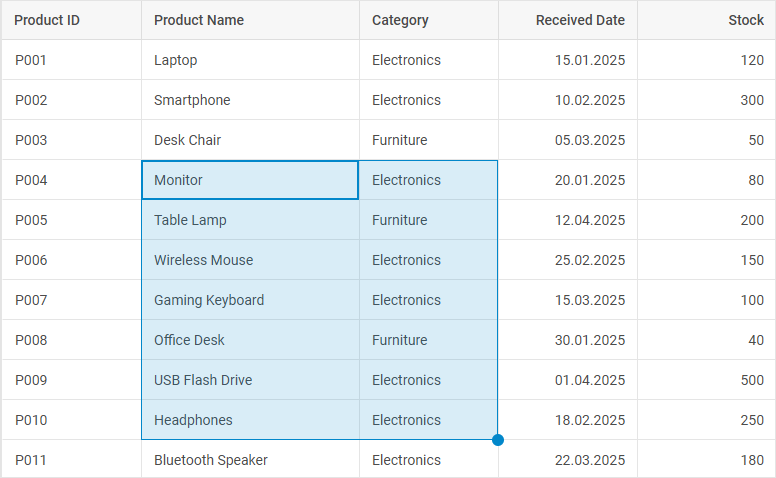

# Work with BlockSelection module

:::tip Pro version only 
This functionality requires PRO version of the DHTMLX Grid (or DHTMLX Suite) package.
:::

You can manage block selection within a grid via the API of the [`BlockSelection`](grid/configuration.md/#managing-block-selection-in-grid) module. It allows selecting ranges of cells using the mouse pointer, touch input, or keyboard navigation, visualizing the selection, and controlling behavior through various modes and handlers. It also supports an [event system](grid/api/api_overview.md/#blockselection-events) to track user actions, including keyboard and mouse combinations.

## Initializing the BlockSelection module

To initialize the `BlockSelection` module, use the [`blockSelection`](grid/api/grid_blockselection_config.md) property in the Grid configuration. Once the Grid is created, the module is accessible through the `grid.block` property.

~~~jsx
const grid = new dhx.Grid("grid_container", {
    columns: [
        { id: "a", header: [{ text: "A" }] },
        { id: "b", header: [{ text: "B" }] },
    ],
    data: [
        { id: "1", a: "A1", b: "B1" },
        { id: "2", a: "A2", b: "B2" },
    ],
    blockSelection: true // enables the BlockSelection module
});
~~~

The `blockSelection` property can also be set as an *object* to enable the module and provide additional configuration options.
Learn about configuration possibilities of the `BlockSelection` module in the [Configuration](grid/configuration.md/#managing-block-selection-in-grid) guide.

## Enabling/disabling BlockSelection module

You can activate the block selection module via the [`enable()`](grid/api/blockselection/enable_method.md) method of the `block` object.
The following example shows how the module is enabled after deactivation on initialization:

~~~jsx {13}
const grid = new dhx.Grid("grid_container", {
    columns: [
        { id: "a", header: [{ text: "A" }] },
        { id: "b", header: [{ text: "B" }] },
    ],
    data: [
        { id: "1", a: "A1", b: "B1" },
        { id: "2", a: "A2", b: "B2" },
    ],
    blockSelection: { disabled: true } // disabled on initialization
});

grid.block.enable(); // activating the module
console.log(grid.block.isDisabled()); // -> false
~~~

To disable the block selection in Grid, use the [`disable()`](grid/api/blockselection/disable_method.md) method of the `block` object.
The example below shows disabling of the `BlockSelection` module:

~~~jsx {13}
const grid = new dhx.Grid("grid_container", {
    columns: [
        { id: "a", header: [{ text: "A" }] },
        { id: "b", header: [{ text: "B" }] },
    ],
    data: [
        { id: "1", a: "A1", b: "B1" },
        { id: "2", a: "A2", b: "B2" },
    ],
    blockSelection: true
});

grid.block.disable(); // disabling the module
console.log(grid.block.isDisabled()); // -> true
~~~

## Checking BlockSelection module state

You can check whether the `BlockSelection` module is disabled, using the [`isDisabled()`](grid/api/blockselection/isdisabled_method.md) method of the `block` object. It returns `true`, if the module is disabled and `false`, if it is enabled. The following example shows checking of the module's activity status:

~~~jsx {13,15}
const grid = new dhx.Grid("grid_container", {
    columns: [
        { id: "a", header: [{ text: "A" }] },
        { id: "b", header: [{ text: "B" }] },
    ],
    data: [
        { id: "1", a: "A1", b: "B1" },
        { id: "2", a: "A2", b: "B2" },
    ],
    blockSelection: true
});

console.log(grid.block.isDisabled()); // -> false
grid.block.disable(); 
console.log(grid.block.isDisabled()); // -> true
~~~

## Using events of the BlockSelection object

To make the process of working with block selection more flexible, you can apply the [related events of the `block` object](grid/api/api_overview.md/#blockselection-events).

## User-interface features 

This section describes the main UI features of the `BlockSelection` module: the way of selecting a range of cells, the available keyboard navigation combinations, as well as the appearance and behavior of the selection handle.

### Cell selection

The main points of cell selection while using the `BlockSelection` module are given below: 

- The user selects a range by dragging the mouse from the initial cell to the end cell. For example, dragging from **A1** to **B3** creates the range **A1:B3**, which is highlighted.
- The `Shift + click` combination allows extending the range from the current initial cell to the clicked cell.
- The cell selection behavior depends on the applied mode: 
    - the `"range"` mode uses the [**RangeSelection API**](grid/api/api_overview.md/#rangeselection-api)
    - the `"manual"` mode requires specifying a custom logic via the [events](grid/api/api_overview.md/#blockselection-events)

### Keyboard navigation

The module supports keyboard navigation for selecting and managing ranges, similar to keyboard navigation used in Google Spreadsheets:
	- **Arrows** (`ArrowUp`, `ArrowDown`, `ArrowLeft`, `ArrowRight`): moves the focus to the adjacent cell, setting the initially selected cell if no selection is active.
	- **Shift + Arrows**: extends the selected range from the current initial cell in the direction of the pressed arrow.
	- **Ctrl + Arrows**: extends the selected range to the last cell in the direction of the pressed arrow.

The **Shift + click** combination is also available. It sets the end cell of the range, extending the selection from the current initial cell.

Keyboard navigation works in both the `"range"` and `"manual"` modes. In the `"manual"` mode, applying the selection (e.g., after `Enter`) requires handling via the events, such as [`beforeBlockSelectionApply`](grid/api/blockselection/beforeblockselectionapply_event.md) and [`afterBlockSelectionApply`](grid/api/blockselection/afterblockselectionapply_event.md).

### Selection handle

The peculiarities of the selection handle functionality are the following: 

- When the handle is enabled via [`blockSelection.handle`](grid/api/grid_blockselection_config.md/#parameters), it appears in the bottom-right corner of the range.
- When the handle is used with **default** settings (the `handler` property isn't specified in the `handle` object) and the `BlockSelection` module is used in the `"range"` mode, the behavior of the handle is the following:
	- copies the value of the first cell of the selected range (or the entire range if selected) to new cells. For example, selecting **A1** (the value is "x") and dragging to **A3** fills **A2**, **A3** with "x".
    - if the range **A1:B1** (the values are "x" and "y", correspondingly) is selected, dragging to **D1** copies "x" to **C1** and "y" to **D1**.
- A custom handler can be specified to modify the behavior (e.g., adding suffixes or other rules).
- In the `"manual"` mode, the handle and `handler` are ignored, and the built-in filling does not work.

## Interaction with other modules

The way of `BlockSelection` API interacting with other grid modules depends on which mode the module is used in: the `"range"` or the `"manual"` mode.

#### Range mode

- The `BlockSelection` module uses the [`RangeSelection` API](grid/api/api_overview.md/#rangeselection-api) to manage continuous rectangular ranges.
- The handle automatically fills data in the new range.
- The selected range will be reset during data grouping or ungrouping.
- The range will be reinstalled to a new one when moving columns or rows.

#### Manual mode

- The `BlockSelection` module does not use the `RangeSelection` API. The developer implements logic via the events such as [`blockSelectionValidate`](grid/api/blockselection/blockselectionvalidate_event.md), [`afterBlockSelectionApply`](grid/api/blockselection/afterblockselectionapply_event.md).
- The handle and built-in filling are unavailable.

## Usage examples

#### Restricting selection in the Range mode

This example shows how to control the start of a block selection and programmatically set a range using the [`RangeSelection` API](grid/api/api_overview.md/#rangeselection-api).

~~~jsx
const grid = new dhx.Grid("grid_container", {
    columns: [
        { id: "a", header: [{ text: "A" }], minWidth: 150 },
        { id: "b", header: [{ text: "B" }], minWidth: 150 },
        { id: "c", header: [{ text: "C" }], minWidth: 150 },
        { id: "d", header: [{ text: "D" }], minWidth: 150 },
        { id: "e", header: [{ text: "E" }], minWidth: 150 },
        { id: "f", header: [{ text: "F" }], minWidth: 150 },
    ],
    data,
    autoWidth: true,
    blockSelection: {
        mode: "range", // setting the "range" mode
        handle: { allowAxis: "xy" }
    }
});

// Controlling the block selection start via the event
grid.block.events.on("blockSelectionValidate", (cell, handle, event) => {
    if (cell.column.id === "a") {
        console.log("Selection cannot start from column A");
        return false;
    }
});

// Setting a range via the `setRange()` method of the Range API
grid.range.setRange({ xStart: "b", xEnd: "d", yStart: "4", yEnd: "8" });
~~~

**Related sample:** [Grid. BlockSelection in the "range" mode. Inventory selection with restricted columns](https://snippet.dhtmlx.com/42fp5qvt)

#### Setting custom logic in the manual mode

This example demonstrates the `"manual"` mode, providing full control and allowing the use of events for custom logic, such as styling.

~~~jsx
const grid = new dhx.Grid("grid_container", {
    columns: [
        { id: "a", header: [{ text: "A" }], minWidth: 150 },
        { id: "b", header: [{ text: "B" }], minWidth: 150 },
        { id: "c", header: [{ text: "C" }], minWidth: 150 },
        { id: "d", header: [{ text: "D" }], minWidth: 150 },
        { id: "e", header: [{ text: "E" }], minWidth: 150 },
        { id: "f", header: [{ text: "F" }], minWidth: 150 },
    ],
    data,
    autoWidth: true,
    blockSelection: { 
        mode: "manual", // Setting the manual mode
        handle: false 
    },
    rangeSelection: true,
});

// Using an event for applying custom styling to a range of cells
grid.block.events.on("afterBlockSelectionApply", (startCell, endCell) => {
    if (
        startCell.column.id === endCell.column.id &&
        startCell.row.id === endCell.row.id
    ) {
        return;
    }
    if (grid.range.getRange) {
        grid.range.getRangedCells().forEach(cell => {
            grid.removeCellCss(cell.row.id, cell.column.id, "custom-selected-cell");
        });
    }

    grid.range.setRange({
        xStart: startCell.column.id,
        xEnd: endCell.column.id,
        yStart: startCell.row.id,
        yEnd: endCell.row.id,
    });

    grid.range.getRangedCells().forEach(cell => {
        grid.addCellCss(cell.row.id, cell.column.id, "custom-selected-cell");
    });
});
~~~

#### Setting a custom handler for the handle

This example shows how to override the handle behavior by adding a custom logic, such as modifying values based on the drag direction.

~~~jsx
/* Define grid columns configuration */
const columns = [
    { id: "productId", header: [{ text: "Product ID" }] }, // Column for the unique product identifier
    { id: "productName", header: [{ text: "Product Name" }] }, // Column for the product name
    { id: "category", header: [{ text: "Category" }] }, // Column for the product category
    { id: "receivedDate", header: [{ text: "Received Date" }], type: "date", dateFormat: "%d.%m.%Y" }, // Date column with the specified format
    { id: "stock", header: [{ text: "Stock" }], type: "number" }, // Numeric column for the stock quantity
    { id: "price", header: [{ text: "Price" }], type: "number", numberMask: { prefix: "$" } } // Numeric column for the price with the dollar prefix
];

/* Initialize DHTMLX Grid with the specified configuration */
const grid = new dhx.Grid("grid_container", {
    columns,
    data,
    autoWidth: true,
    history: true, // Enable history tracking for undo/redo
    blockSelection: {
        handle: {
            allowAxis: "y", // Allow selection along the y-axis (rows)
            handler: blockSelectionHandler, // Custom handler for block selection
        },
    },
});

/* Set initial selection range for the grid */
grid.range.setRange({
    xStart: "productId", // Start selection at the "productId" column
    yEnd: grid.data.getId(0), // End selection at the first row
});

/* Initialize objects to store initial values and column indices */
let initValues = {}; // Store initial values for each column
let columnIndex = {}; // Track index increments for each column

/* The handler function for block selection events */
function blockSelectionHandler({ cell, array, index, grid }) {
    // Reset tracking objects if this is the first cell in the selection
    if (!index) {
        initValues = {};
        columnIndex = {};
    }
    const columnId = cell.column.id;
    // Initialize values for a new column if not already set
    if (!initValues[columnId]) {
        initValues[columnId] = cell.row[columnId]; // Store the initial cell value
        columnIndex[columnId] = 0; // Initialize the index counter
        return { prev: initValues[columnId], current: initValues[columnId] }; // Return unchanged values
    }

    // Increment column index for the current column
    const colIndex = columnIndex[columnId] += 1;
    const initValue = initValues[columnId]; // Get the initial value for a column
    let prev = current = cell.row[columnId]; // Set the default previous and current values

    // Modify the current value based on the column type
    switch (cell.column.type) {
        case "number":
            current = initValue + colIndex * 10; // Increment the number by 10 per row
            break;
        case "date":
            // Parse ISO date and increment the day by colIndex
            const [year, month, day] = initValue.split("-");
            current = new Date(Number(year), Number(month) - 1, Number(day) + colIndex).toISOString();
            break;
        default:
            current = initValue; // Keep the default value for other types
            break;
    }

    // Custom formatting for specific columns
    if (columnId === "productId") {
        // Generate a new product ID with the format P00N
        current = `P00${parseInt(initValue.replace(/\D/g, "")) + colIndex}`;
    }
    if (columnId === "category") {
        // Append the index in parentheses to the category
        current = `${current} (${colIndex})`;
    }

    // Create the history object for undo/redo
    const history = { prev, current };
    // Update grid data with the new value
    grid.data.update(cell.row.id, { [columnId]: current },
        index < array.length - 1 // Continue updating if it isn't the last cell in selection
    );
    return history; // Return the history for tracking
}
~~~

**Related sample:** [Grid. BlockSelection. Work with the handle configuration](https://snippet.dhtmlx.com/8kttktiy)

#### Selection styling

This example demonstrates how to customize the appearance of the selected range and of the handle.

~~~html

~~~

**Related sample:** [Grid. BlockSelection. Stylization of the area](https://snippet.dhtmlx.com/qr5xyqpu)