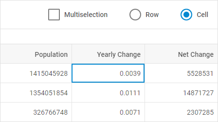
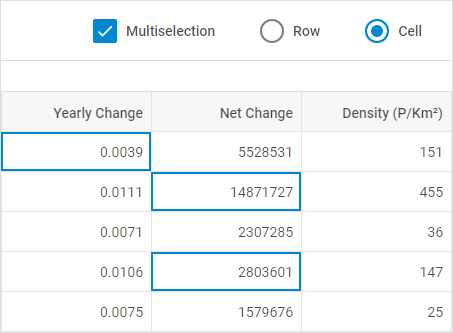
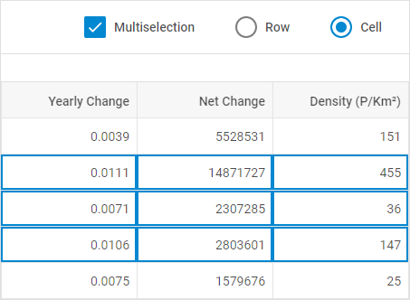

---
sidebar_label: Work with Selection Object
title: Work with Selection Object
description: description
---          

You can manipulate with Grid cells via the API of the selection object. It is possible to get the object of one or more selected cells or rows, to set selection as to a single row or cell as to multiple rows or cells. The selection object also allows removing selection from previously selected cells.

Enabling/Disabling Selection object
---------------------------------

Starting from v7.0, you can activate selection of cells via the  method of the selection object.

~~~js
grid.selection.enable();
~~~

To disable selection of cells in Grid, make use of the  method of the selection object:

~~~js
grid.selection.disable();
~~~

Setting selection to cells
-----------------------------

You can set selection to one or more rows or cells using the [setCell()](grid/api/selection/selection_setcell_method.md) method of the selection object. The method takes the following parameters:

<table class="webixdoc_links">
	<tbody>
        <tr>
			<td class="webixdoc_links0"><b>row</b></td>
			<td>(<i>object|string</i>) an object with a cell to be selected or the id of a row</td>
		</tr>
        <tr>
			<td class="webixdoc_links0"><b>column</b></td>
			<td>(<i>object|string</i>) the config of a column or its id</td>
		</tr>
        <tr>
			<td class="webixdoc_links0"><b>ctrlUp</b></td>
			<td>(<i>boolean</i>) <i>true</i> - to select the desired rows or cells, otherwise - <i>false</i> (<a href="https://docs.dhtmlx.com/suite/grid__configuration.html#multipleselectionofgridcells">for multiselection mode</a>)</td>
		</tr>
        <tr>
			<td class="webixdoc_links0"><b>shiftUp</b></td>
			<td>(<i>boolean</i>) <i>true</i> - to select a range of rows or cells, otherwise - <i>false</i> (<a href="https://docs.dhtmlx.com/suite/grid__configuration.html#multipleselectionofgridcells">for multiselection mode</a>)</td>
		</tr>
    </tbody>
</table>

### Setting selection to a cell

The example below shows how to highlight the first cell in the "Yearly Change" column:

~~~js
var grid = new dhx.Grid("grid_container", {
    columns: [// columns config],
	selection:"cell",
	multiselection: false, /*!*/
    data: dataset
});

var row = grid.data.getItem(grid.data.getId(0));
var column = grid.getColumn("yearlyChange");
grid.selection.setCell(row, column);
~~~

{{editor    https://snippet.dhtmlx.com/4nj0e9ye	Grid. Multiselection}}

{{note The **multiselection** property is disabled.}}

### Setting selection to multiple cells/rows

You can highlight the desired cells when the [multiselection:true](grid/api/grid_multiselection_config.md) and the [selection:"cell"](grid/api/grid_selection_config.md) properties are set:

~~~js
var grid = new dhx.Grid("grid_container", {
    columns: [// columns config],
	selection:"cell",  /*!*/
	multiselection: true, /*!*/
    data: dataset
});

grid.selection.setCell(grid.data.getId(0),"yearlyChange");
grid.selection.setCell(grid.data.getId(1),"netChange", true, false);
grid.selection.setCell(grid.data.getId(3),"netChange", true, false);
~~~

{{editor    https://snippet.dhtmlx.com/4nj0e9ye	Grid. Multiselection}}

It is also possible to select a range of cells at once:

For that, manipulate the **ctrlUp** and **shiftUp** parameters accordingly:

~~~js
grid.selection.setCell(grid.data.getId(1),"yearlyChange");
grid.selection.setCell(grid.data.getId(3),"destiny", false, true);
~~~

{{editor    https://snippet.dhtmlx.com/4nj0e9ye	Grid. Multiselection}}

{{note Use the **selection:"rows"** property to be able to operate rows. }}

To make the process of selecting cells more flexible, you can apply the related events of the selection object:

- [afterSelect](grid/api/selection/selection_afterselect_event.md)
- [beforeSelect](grid/api/selection/selection_beforeselect_event.md)

Removing selection
-------------------

Starting from v7.0, you can remove selection from a selected cell/row or from highlighted cells/rows using the  method of the selection object. The method takes two parameters:

<table class="webixdoc_links">
	<tbody>
        <tr>
			<td class="webixdoc_links0"><b>rowId</b></td>
			<td>(<i>string|number</i>) optional, the id of a row</td>
		</tr>
        <tr>
			<td class="webixdoc_links0"><b>colId</b></td>
			<td>(<i>string|number</i>) optional, the id of a column</td>
		</tr>
    </tbody>
</table>

~~~js
// unselects all previously selected cells
grid.selection.removeCell();
 
// unselects all previously selected cells of the specified row
grid.selection.removeCell(rowId);
 
// removes selection from the specified cell
grid.selection.removeCell(rowId, colId);
~~~

To make the process of unselecting cells more flexible, you can apply the related events of the selection object:

- [afterUnSelect](grid/api/selection/selection_afterunselect_event.md) 
- [beforeUnSelect](grid/api/selection/selection_beforeunselect_event.md)

Getting object of selected cells
-------------------------------

To get the object of a selected Grid cell, use the [getCell()](grid/api/selection/selection_getcell_method.md) method of the selection object:

~~~js
var selectedCell = grid.selection.getCell();
// -> {row: {…}, column: {…}}
~~~

To get the object of multiple selected cells, use the [getCells()](grid/api/selection/selection_getcells_method.md) method of the selection object:

~~~js
var selectedCells = grid.selection.getCells();
// -> [{…}, {…}, {…}]
0: {row: {…}, column: {…}}
1: {row: {…}, column: {…}}
2: {row: {…}, column: {…}}
~~~
