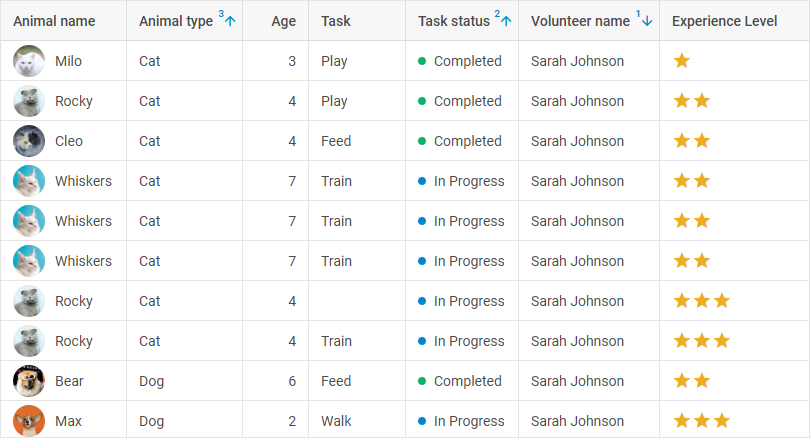

# Sorting and filtering data 

When working with data you may need to sort or filter it. You can sort or filter the data of a component via the DataCollection API.

## Sorting data

To sort data items in a component, use the [`sort()`](data_collection/api/datacollection_sort_method.md) method of [DataCollection](data_collection.md). The method takes two parameters:

- `rule?: object` - optional, an object with parameters for sorting. The object has the following attributes:
    - `by?: string | number` - optional, the id of a data field 
    - `dir?: string` - optional, the direction of sorting: "asc" or "desc"
    - `as?: function` -  optional, a function that specifies the type to sort data as
    - `rule?: function` -  optional, a sorting rule; the function must have two parameters and return a number (-1,0,1)
- `config?: object` - optional, defines the parameter of sorting. It may contain one property:
    - `smartSorting?: boolean` - optional, specifies whether a sorting rule should be applied each time after changing the data set

~~~jsx
grid.data.sort(
    {
        by:"a",
        dir:"desc",
        as: item => (item.toUpperCase())
    },
    { smartSorting: true }
);

// cancels the applied sorting rules
grid.data.sort();
~~~

**Related sample**: [Data. Sorting](https://snippet.dhtmlx.com/lz351u47)

:::note 
Calling the method without parameters will discard all the applied sorting rules.
:::

### Custom sorting

You can specify the `rule` attribute in the object passed to the `sort()` method to set a custom function for sorting. For example:

~~~jsx
grid.data.sort({
    rule: (a, b) => a.id > b.id ? 1 : (a.id < b.id ? -1 : 0) 
});
~~~

### Multi-sorting

:::tip pro version only
The described functionality requires PRO version of the DHTMLX Grid (or DHTMLX Suite) package.
:::

You can sort the data of a component by multiple columns simultaneously. To enable this functionality, you should specify the `smartSorting?: true` property in the configuration object passed as a second parameter of the `sort` method. It will apply the sorting rule set as first parameter each time the data set is modified:

~~~jsx
const grid = new dhx.Grid("grid_container", {
    columns:[
        // columns config
    ]
    // more options
});

grid.data.sort({ by: "volunteer_name", dir: "desc" }, { smartSorting: true });
grid.data.sort({ by: "task_status", dir: "asc" });
grid.data.sort({ by: "animal_type", dir: "asc" });
~~~

In the above example Grid data is sorted with the help of the `sort()` method of [DataCollection](data_collection.md) by several columns - "volunteer_name", "task_status" and "animal_type".

**Related sample**: [Grid. Sorting by multiple columns (multisorting)](https://snippet.dhtmlx.com/4ej0i3qi)

### Getting the sorting state

To get the current state of sorting data in Grid, use the [`getSortingStates()`](data_collection/api/datacollection_getsortingstates_method.md) method of DataCollection. The method allows getting the result of sorting data and returns an array of objects with the following properties:

<table>
    <tbody>
        <tr>
            <td><b>by</b></td>
            <td>(<i>string | number</i>) the id of a data field to sort by</td>
        </tr>
        <tr>
            <td><b>dir</b></td>
            <td>(<i>string</i>) the direction of sorting: "asc" or "desc"</td>
        </tr>
        <tr>
            <td><b>as</b></td>
            <td>(<i>function</i>) a custom function of converting values before comparing</td>
        </tr>
        <tr>
            <td><b>rule</b></td>
            <td>(<i>function</i>) a custom sorting function</td>
        </tr>
        <tr>
            <td><b>smartSorting</b></td>
            <td>(<i>boolean</i>) (if applied) specifies whether a sorting rule should be applied each time after changing the data set</td>
        </tr>
    </tbody>
</table>

~~~jsx
const state = grid.data.getSortingStates(); 
// -> [{ by: "country", dir: "desc" }, { by: "population", dir: "desc" }]
~~~

## Filtering data

To filter data items in a component, use the [`filter()`](data_collection/api/datacollection_filter_method.md) method of [DataCollection](data_collection.md). The method takes two parameters:

<table>
    <tbody>
        <tr>
            <td><b>rule</b></td>
            <td>(<i>function | object</i>) optional, the filtering criteria. It can be:<ul><li>a filtering function. It takes as a parameter a data item and returns <i>true/false</i></li><li>an object with the following attributes:<ul><li><b>`by?: string | number`</b> - optional, the id of a column</li><li><b>`match?: string`</b> - optional, a pattern to match </li><li><b>`compare?: function`</b> - optional, a function for extended filtering that takes the following parameters:<ul><li><b>`value`</b> - the value to compare </li><li><b>`match`</b> - a pattern to match </li><li><b>`item`</b> - a data item the values of which should be compared</li></ul></li></ul></li></ul></td>
        </tr>
        <tr>
            <td><b>config</b></td>
            <td>(<i>object</i>) optional, an object with the following properties:<ul><li><b>`id?: string`</b> - optional, the id of the filter</li><li><b>`add?: boolean`</b> - optional, defines whether each next filtering will be applied to the already filtered data (<i>true</i>), or to the initial data (<i>false</i>, default)</li><li><b>`permanent?: boolean`</b> - optional, <i>true</i> to make the current filter permanent. It will be applied even if the next filtering doesn't have the <b>`add:true`</b> property in its configuration object. Such a filter can be removed just with the <a href="../datacollection_resetfilter_method/">`resetFilter()`</a> method</li></ul></td>
        </tr>
        <tr>
            <td><b>silent</b></td>
            <td>(<i>boolean</i>) optional, if set to <i>true</i>, the method will be called without triggering events, <i>false</i> by default</td>
        </tr>
    </tbody>
</table>

:::info
Note that after calling the method with the `silent:true` parameter, you may need to repaint the component with the `paint()` method.
:::

The `filter()` method returns the id of the filter.

~~~jsx
// filtering data by a function
grid.data.filter(function (item) {
    return item.a > 0 && item.b !== "Apple";
});

// or
grid.data.filter(function (item) {
    return item.a > 0 && item.b !== "Apple";
}, {
    add: true,
});

// filtering data by the column
grid.data.filter({
    by: "a",
    match: "Orange",
    compare: function (value, match, item) {
        if (item.a !== "Some") {
            return val === "New";
        }
    return false;
    }
}, {
    add: true,
});
~~~

**Related sample**: [Data. Filter](https://snippet.dhtmlx.com/csiwq3kj)

### Getting filters

You can get filters applied to the data of a component using the [`getFilters()`](data_collection/api/datacollection_getfilters_method.md) method. The method takes the following parameter:

- `permanent?: boolean` - optional, *false* by default. Allows getting the list of permanent filters

and returns an object with the applied filters, where the key is the id of a filter and the value is an object with the [`rule` and `config` properties](data_collection/api/datacollection_filter_method.md).

~~~jsx
const filters = grid.data.getFilters();
~~~

### Resetting filters

You can reset a certain filter or all the active filters using the [`resetFilter()`](data_collection/api/datacollection_resetfilter_method.md) method. It takes the following parameter:

- `config?: object` - optional, specifies the parameters of resetting the active filters. If the config isn't specified or it is empty, all the filters except for those that have the `permanent` property in the configuration object will be reset. Can contain the following properties:
    - `id?: string` - optional, the id of the filter to reset
    - `permanent?: boolean` - optional, *true* to reset all the active filters, including those that have the `permanent:true` property in their config
- `silent?: boolean` - optional, if set to *true*, the method will be called without triggering events, *false* by default

:::info
Note that after calling the method with the `silent:true` parameter, you may need to repaint the component with the `paint()` method.
:::

The method returns *true*, if all the filters, including the permanent ones, have been reset; otherwise *false*.

~~~jsx
// resets all the filters, except for those that have the "permanent" property in the config
component.data.resetFilter();

// resets all the filters, including those that have the "permanent" property in the config
component.data.resetFilter({ permanent: true });

// resets the filter with the specified id
component.data.resetFilter({ id: "filter_id" });
~~~

**Related samples**: 
- [Data. ResetFilter](https://snippet.dhtmlx.com/jg8wxfvc)
- [Grid. ResetFilter](https://snippet.dhtmlx.com/15trblk2)

## Getting the initial data

You can get the initial values of the items of a widget initialized in a data collection using the [`getInitialData()`](data_collection/api/datacollection_getinitialdata_method.md) method. It returns an array of item objects with initial values.

~~~jsx
const startingData = component.data.getInitialData();
~~~

**Related sample**: [Data. Get initial data](https://snippet.dhtmlx.com/l6wun9j4)
