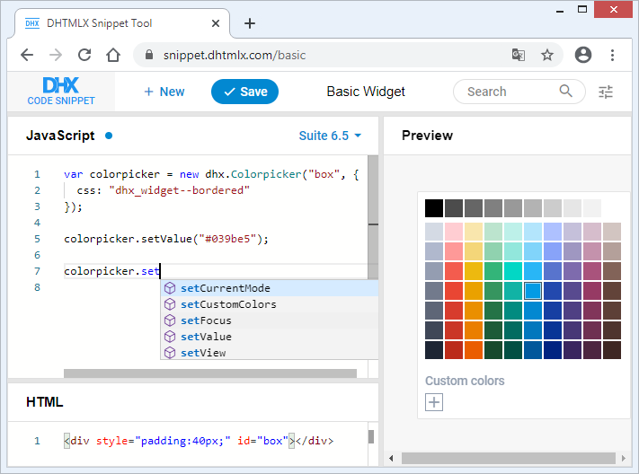

# TypeScript support

The dhtmlxSuite library of version 6.5 and higher lets you work with DHTMLX components faster and more effectively by using TypeScript definitions.

The library provides a built-in support of Typescript that should work out of the box.

{{note You can try out the functionality directly in our <a href="https://snippet.dhtmlx.com/basic"  target="_blank">Snippet Tool</a>.}}

### Benefits of using TypeScript 

The main advantage of TypeScript is that the app development becomes much easier, safety, and productive. Checking the types together with autocompletion will help you to avoid common mistakes and, therefore, to write a more stable code.  

Moreover, using TypeScript is a good practice as all modern IDE will provide suggestions and type checking for your code created with DHTMLX.
