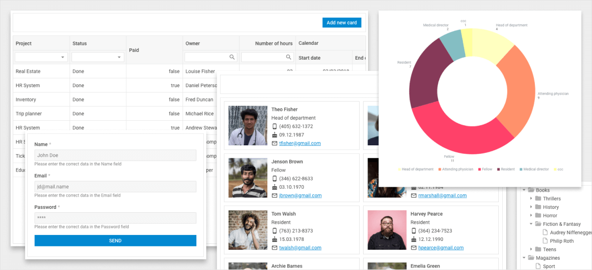
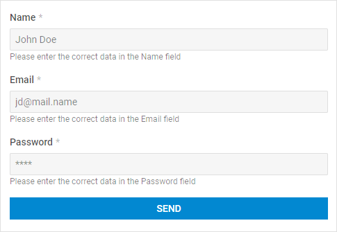
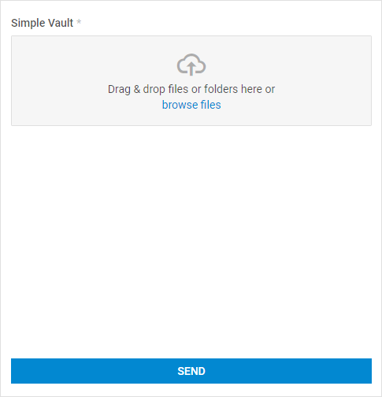
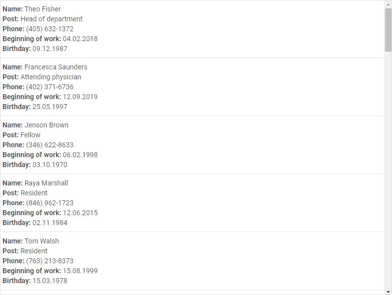
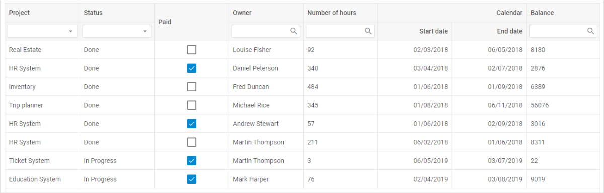
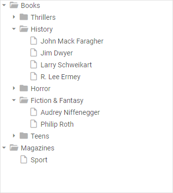
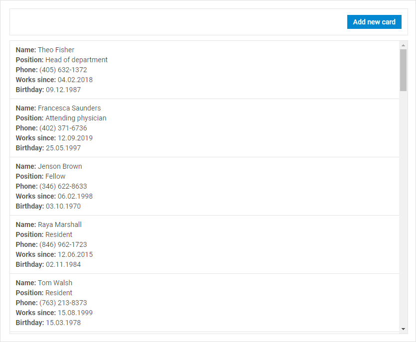
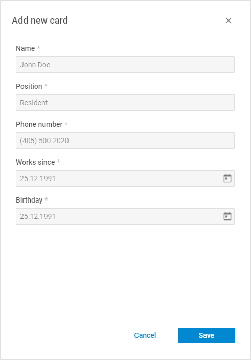
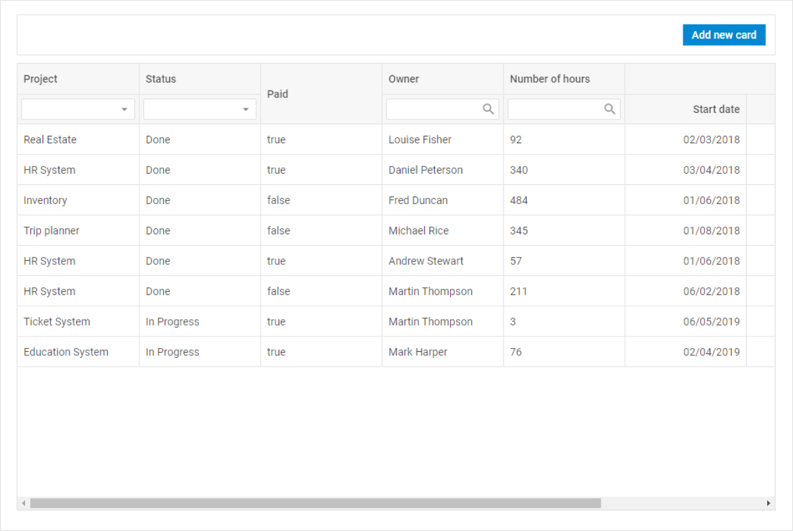
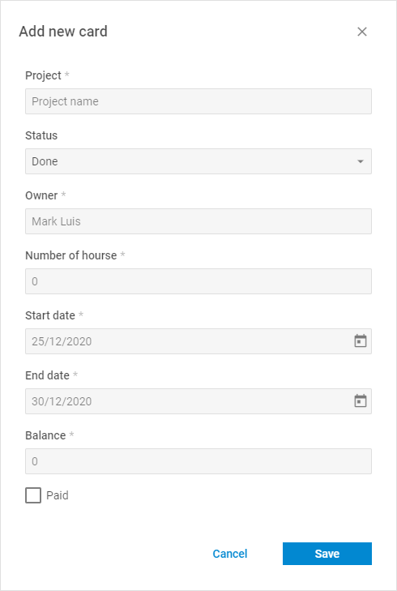

# How to connect DHTMLX Suite with a backend

DHTMLX Suite 7 or DHTMLX components don't have any special requirements for the backend. They can be easily connected with any backend platform which supports the REST API (RESTful API).

To transfer data from your backend to the Suite, all you need to do is create a valid JSON dataset. The DHTMLX component does it using its DataCollection helper – the [load()](/data_collection/api/datacollection_load_method/) method.

The REST API is supported in both directions. To transfer data from DHTMLX Suite 7 to your backend, you can use any possibility that the REST API provides.

Pay attention to the [serialize()](/data_collection/api/datacollection_serialize_method/) and [save()](/data_collection/api/datacollection_save_method/) methods of DataCollection. They can be helpful for you on the matter.

Take a look at the [Examples of using DHTMLX Suite widgets with Node.js](https://github.com/DHTMLX/nodejs-suite-demo).

## Examples of using DHTMLX Suite widgets with Node.js

Let's have an overview of the examples. Here you can find 10 interactive samples. Follow the instructions in the README.md file to run the examples.

You can easily modify any widget for your purposes and find out how it works.

Pay attention: the components of the demo work with one database. When editing data in one component, you affect data in all others components.

To reset the database, stop the server and delete the file with the `.sqlite` extension from the project's root directory.

### Form. Sending data

A nice Form to collect data. Easy to use and modify.

The following request method is used in this example: `POST`.

### Simple Vault. Sending data

Ready to use. The Simple Vault for files and folders.

The following request method is used in this example: `POST`.

### DataView. Getting data

One of the best ways to organize and display objects with similar information.

The following request method is used in this example: `GET`.

### List. Getting data

A List is another convenient way to organize information.

The following request method is used in this example: `GET`.

### Chart. Getting data

The Chart can help you visualize your data. It is interactive and useful for comparing the data you need.

The following request method is used in this example: `GET`.

### Grid. Getting data, inline editing, and sending data

The options of sorting and searching for information are shown in the Grid example. You can also check how a selection of rows and cells works.

The following request methods are used in this example: `GET`, `PUT`.

### Tree. Getting data, inline editing, and sending data

The sample of a Tree widget shows you the way to organize the information in a tree-like structure. It is interactive. You can drag-and-drop the items, rename them, and change the current example's structure.

The following request methods are used in this example: `GET`, `PUT`.

### DataView with Form and Window. Getting, editing, deleting, and sending data

This example of DataView shows you more opportunities to manipulate the widget. Click the card to edit or delete it. Add a new card with the help of the corresponding button.

The following request methods are used in this example: `GET`, `PUT`, `POST`, `DELETE`.

### List with Form and Window. Getting, editing, deleting, and sending data

The example of an interactive List shows you the opportunities to delete and edit cards, add a new card.

The following request methods are used in this example: `GET`, `PUT`, `POST`, `DELETE`.

### Grid with Form and Window. Getting, editing, deleting, and sending data

The interactive Grid example helps you understand how simple you can manipulate the widget. You can also easily use this example in your own project.

The following request methods are used in this example: `GET`, `PUT`, `POST`, `DELETE`.
