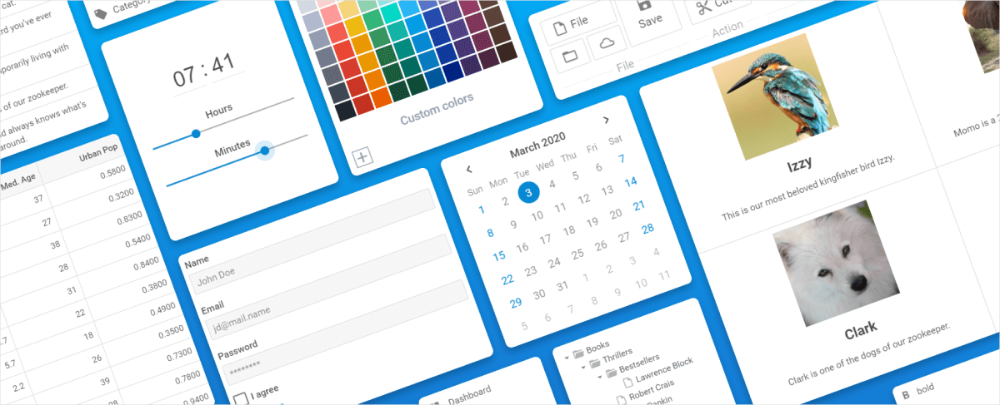

# Code examples of how to useWidgets with Vue.js

DHTMLX Suite is compatible with Vue.js. We prepared code examples of how to use DHTMLX widgets with Vue.js.

- To check online samples, please visit the Code examples page: [DHTMLX widgets with Vue](https://dhtmlx.github.io/vue-suite-demo).
- To download samples, please check our GitHub repository: [DHTMLX Widgets + Vue.js](https://github.com/DHTMLX/vue-suite-demo). The README.md file provides all the necessary information on how to run the app in the development mode.
