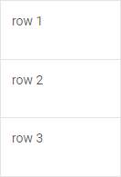
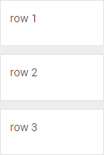
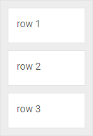
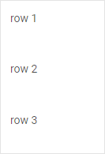

# Configuration of a Cell

## HTML content

A layout cell can have any HTML content inside it. You can set it with the  attribute in the object of a cell.

~~~js
const layout = new dhx.Layout("layout_container", {
    cols: [
        { header: "Cell header", html: "Hello world"}
    ]
});
~~~

**Related sample**: [Layout. HTML content](https://snippet.dhtmlx.com/6x76kgyq)

## Hidden cell

It is possible to add the  attribute into the the object of a cell(s) to render a layout with some cells hidden:

~~~js
const layout = new dhx.Layout("layout_container", {
    cols: [
	    { header: "Cell header", hidden:true}
    ]
});
~~~

## Cell header

Each layout cell can have a header with some text that describes the content of this cell.

~~~js
const layout = new dhx.Layout("layout_container", {
    cols: [
	    { header: "Perfect cell header"}
    ]
});
~~~

You can also add an icon or an image into the header of a cell with the help of corresponding attributes -  and .

~~~js
const layout = new dhx.Layout("layout_container", {
    cols: [
	    { header: "Cell header", headerIcon:"/icon.png"}
    ]
});

// or
const layout = new dhx.Layout("layout_container", {
    cols: [
	    { header: "Cell header", headerImage:"/img.png"}
    ]
});
~~~

**Related sample**: [Layout. Header](https://snippet.dhtmlx.com/bxqnzesl)

## Height of a header cell

You can specify the necessary height of the header of a cell using the  configuration option of the cell:

~~~js
const layout = new dhx.Layout("layout_container", {
    rows: [
        {
            id: "row1"
        },
        {
            id: "row2",
            header: "Row 2",
            headerHeight: 80
        }
    ]
});
~~~

**Related sample**: [Layout. Header](https://snippet.dhtmlx.com/bxqnzesl)

If the  property is not set in the config of a cell, the  option will add a header without text for a cell.

## Cell size

You can easily control and change the size of a cell via the  and  attributes of the object of a cell.

~~~js
const layout = new dhx.Layout("layout_container", {   
	rows: [
        {
            cols: [
                {
                    header: "Block 1",
                    width: "40%"                                
                },
                {
                    header: "Block 2",                  
                    width: "60%"
                }
            ]
        },
        {
            rows: [
                {
                    header: "Block 3",
                    height: "200px"                             
                },
                {
                    header: "Block 4",                              
                    height: "300px"
                }
            ]
        }
    ]
});
~~~

Starting from v7.0, you can define the maximal and minimal sizes for a cell by using its corresponding configuration properties: , , , .

~~~js
const layout = new dhx.Layout("layout_container", {
    cols: [
        { 
            header: "Cell header", 
            minWidth: "400px",
            maxWidth: "600px",
            minHeight: "40px",
            maxHeight: "100px"
        }
    ]
});
~~~

{{note Note, that [minWidth](layout/api/cell/layout_cell_minwidth_config.md)/[maxWidth](layout/api/cell/layout_cell_maxwidth_config.md) properties prevent [the width of a cell](layout/api/cell/layout_cell_width_config.md) from being less/greater than minWidth/maxWidth values accordingly. The [minHeight](layout/api/cell/layout_cell_minheight_config.md)/[maxHeight](layout/api/cell/layout_cell_maxheight_config.md) options work in the same way. }}

~~~js
const layout = new dhx.Layout("layout_container", {
    cols: [
        { 
            header: "Cell header", 
            width: "50%", 
            maxWidth: "200px" 
        }
    ]
});
~~~

As you can see from the code example above, the width of the cell occupies 50% of the parent container width but is not larger than 200px.

### Autosize for cells

Starting with v7.0, you can configure a cell so that its width/ height would automatically adjust to the width/ height of the cell content. For this purpose, you need to set the [width](layout/api/cell/layout_cell_width_config.md)/ [height](layout/api/cell/layout_cell_height_config.md) options to *"content"*:

~~~js {5}
const layout = new dhx.Layout("layout_container", {
    cols: [
        { 
            header: "Cell header", 
            width: "content"
        },
        // more options
    ]
});
~~~

## Collapsibility

There are two attributes of the object of a cell:  and . The first one defines whether a cell can be collapsed and expanded, and the second one checks whether a cell is collapsed during
the initialization of a layout.

~~~js
const layout = new dhx.Layout("layout_container", {
    cols: [
        { header: "Cell header", collapsable:true, collapsed:false}
    ]
});
~~~

**Related sample**: [Layout. Collapsable and resizable](https://snippet.dhtmlx.com/f1f49n35)

**Related sample**: [Layout. Accordion](https://snippet.dhtmlx.com/r2e0y6n7)

## Resizability

To allow resizing of a cell, make use of the  option in the object of a cell. 

~~~js
const layout = new dhx.Layout("layout_container", {
    cols: [
        { header: "Cell header", resizable:true}
    ]
});
~~~

**Related sample**: [Layout. Collapsable and resizable](https://snippet.dhtmlx.com/f1f49n35)

{{note Starting from v7.0, you can define the resizing limits by setting necessary values to the [minWidth](layout/api/cell/layout_cell_minwidth_config.md)/[maxWidth](layout/api/cell/layout_cell_maxwidth_config.md), [minHeight](layout/api/cell/layout_cell_minheight_config.md)/[maxHeight](layout/api/cell/layout_cell_maxheight_config.md) properties in the config of a cell.}}

## Setting borders for cells

By default, there is no space and borders between cells inside a layout and the cells look like they are merged. Starting from v7.0, it is possible to split the cells by adding borders or space between them via the  configuration property of a Layout cell:

~~~js {2}
const layout = new dhx.Layout("layout_container", {
    type: "space",
    cols: [
        {
            html: "1"
        },
        {
            html: "2"
        },
        {
            html: "3"
        }
    ]
});
~~~

**Related sample**: [Layout. Types: space, wide, line, none](https://snippet.dhtmlx.com/9ge1a4zx)

**Related sample**: [Layout. Types in a complex layout](https://snippet.dhtmlx.com/w00fgl57)

The available values of the option are "line", "wide", "space", "none".

| type:"line"                         | type:"wide"                         | type:"space"                         | type:"none"                               |
| ----------------------------------- | ----------------------------------- | ------------------------------------ | ----------------------------------------- |
|  |  |  |  |
