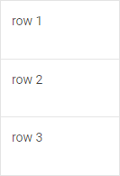
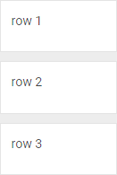
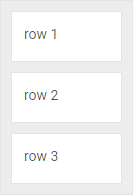
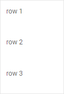

# Configuration of a Cell

## HTML content

A layout cell can have any HTML content inside it. You can set it with the [html](/layout/api/cell/layout_cell_html_config/) attribute in the object of a cell.

~~~js
const layout = new dhx.Layout("layout_container", {
    cols: [
        { header: "Cell header", html: "Hello world"}
    ]
});
~~~

**Related sample**: [Layout. HTML content](https://snippet.dhtmlx.com/6x76kgyq)

## Hidden cell

It is possible to add the [hidden](/layout/api/cell/layout_cell_hidden_config/) attribute into the the object of a cell(s) to render a layout with some cells hidden:

~~~js
const layout = new dhx.Layout("layout_container", {
    cols: [
        { header: "Cell header", hidden:true}
    ]
});
~~~

## Cell header

Each layout cell can have a header with some text that describes the content of this cell.

~~~js
const layout = new dhx.Layout("layout_container", {
    cols: [
        { header: "Perfect cell header"}
    ]
});
~~~

You can also add an icon or an image into the header of a cell with the help of corresponding attributes - [headerIcon](/layout/api/cell/layout_cell_headericon_config/) and [headerImage](/layout/api/cell/layout_cell_headerimage_config/).

~~~js
const layout = new dhx.Layout("layout_container", {
    cols: [
        { header: "Cell header", headerIcon:"/icon.png"}
    ]
});

// or
const layout = new dhx.Layout("layout_container", {
    cols: [
        { header: "Cell header", headerImage:"/img.png"}
    ]
});
~~~

**Related sample**: [Layout. Header](https://snippet.dhtmlx.com/bxqnzesl)

## Height of a header cell

You can specify the necessary height of the header of a cell using the [headerHeight](/layout/api/cell/layout_cell_headerheight_config/) configuration option of the cell:

~~~js
const layout = new dhx.Layout("layout_container", {
    rows: [
        {
            id: "row1"
        },
        {
            id: "row2",
            header: "Row 2",
            headerHeight: 80
        }
    ]
});
~~~

**Related sample**: [Layout. Header](https://snippet.dhtmlx.com/bxqnzesl)

If the [header](/layout/api/cell/layout_cell_header_config/) property is not set in the config of a cell, the [headerHeight](/layout/api/cell/layout_cell_headerheight_config/) option will add a header without text for a cell.

## Cell size

You can easily control and change the size of a cell via the [width](/layout/api/cell/layout_cell_width_config/) and [height](/layout/api/cell/layout_cell_height_config/) attributes of the object of a cell.

~~~js
const layout = new dhx.Layout("layout_container", {   
    rows: [
        {
            cols: [
                {
                    header: "Block 1",
                    width: "40%"                                
                },
                {
                    header: "Block 2",                  
                    width: "60%"
                }
            ]
        },
        {
            rows: [
                {
                    header: "Block 3",
                    height: "200px"                             
                },
                {
                    header: "Block 4",                              
                    height: "300px"
                }
            ]
        }
    ]
});
~~~

Starting from v7.0, you can define the maximal and minimal sizes for a cell by using its corresponding configuration properties: [maxHeight](/layout/api/cell/layout_cell_maxheight_config/), [maxWidth](/layout/api/cell/layout_cell_maxwidth_config/), [minHeight](/layout/api/cell/layout_cell_minheight_config/), [minWidth](/layout/api/cell/layout_cell_minwidth_config/).

~~~js
const layout = new dhx.Layout("layout_container", {
    cols: [
        { 
            header: "Cell header", 
            minWidth: "400px",
            maxWidth: "600px",
            minHeight: "40px",
            maxHeight: "100px"
        }
    ]
});
~~~

{{note Note, that [minWidth](/layout/api/cell/layout_cell_minwidth_config/)/[maxWidth](/layout/api/cell/layout_cell_maxwidth_config/) properties prevent [the width of a cell](/layout/api/cell/layout_cell_width_config/) from being less/greater than minWidth/maxWidth values accordingly. The [minHeight](/layout/api/cell/layout_cell_minheight_config/)/[maxHeight](/layout/api/cell/layout_cell_maxheight_config/) options work in the same way. }}

~~~js
const layout = new dhx.Layout("layout_container", {
    cols: [
        { 
            header: "Cell header", 
            width: "50%", 
            maxWidth: "200px" 
        }
    ]
});
~~~

As you can see from the code example above, the width of the cell occupies 50% of the parent container width but is not larger than 200px.

### Autosize for cells

Starting with v7.0, you can configure a cell so that its width/ height would automatically adjust to the width/ height of the cell content. For this purpose, you need to set the [width](/layout/api/cell/layout_cell_width_config/)/ [height](/layout/api/cell/layout_cell_height_config/) options to *"content"*:

~~~js {5}
const layout = new dhx.Layout("layout_container", {
    cols: [
        { 
            header: "Cell header", 
            width: "content"
        },
        // more options
    ]
});
~~~

## Collapsibility

There are two attributes of the object of a cell: [collapsable](/layout/api/cell/layout_cell_collapsable_config/) and [collapsed](/layout/api/cell/layout_cell_collapsed_config/). The first one defines whether a cell can be collapsed and expanded, and the second one checks whether a cell is collapsed during
the initialization of a layout.

~~~js
const layout = new dhx.Layout("layout_container", {
    cols: [
        { header: "Cell header", collapsable:true, collapsed:false}
    ]
});
~~~

**Related sample**: [Layout. Collapsable and resizable](https://snippet.dhtmlx.com/f1f49n35)

**Related sample**: [Layout. Accordion](https://snippet.dhtmlx.com/r2e0y6n7)

## Progress bar

You can configure a Layout cell so that it would render a progress bar (in other words, a loading spinner) if there is no any component or HTML content attached to the cell. To do that, enable the [progressDefault](/layout/api/cell/layout_cell_progressdefault_config/) attribute in the configuration object of the cell:

~~~js {9,14}
const layout = new dhx.Layout("layout_container", {
    type: "line",
    rows: [
        {
            id: "one",
            header: "Header",
            height: "250px",
            resizable: true,
            progressDefault: true
        },
        {
            id: "two",
            height: "250px",
            progressDefault: true,
        },
    ]
});
~~~

Note, as soon as you attach a component or HTML content to the cell, the progress bar will be hidden.

By default, the [progressDefault](/layout/api/cell/layout_cell_progressdefault_config/) attribute is disabled.

## Resizability

To allow resizing of a cell, make use of the [resizable](/layout/api/cell/layout_cell_resizable_config/) option in the object of a cell. 

~~~js
const layout = new dhx.Layout("layout_container", {
    cols: [
        { header: "Cell header", resizable:true}
    ]
});
~~~

**Related sample**: [Layout. Collapsable and resizable](https://snippet.dhtmlx.com/f1f49n35)

{{note Starting from v7.0, you can define the resizing limits by setting necessary values to the [minWidth](/layout/api/cell/layout_cell_minwidth_config/)/[maxWidth](/layout/api/cell/layout_cell_maxwidth_config/), [minHeight](/layout/api/cell/layout_cell_minheight_config/)/[maxHeight](/layout/api/cell/layout_cell_maxheight_config/) properties in the config of a cell.}}

## Setting borders for cells

By default, there is no space and borders between cells inside a layout and the cells look like they are merged. Starting from v7.0, it is possible to split the cells by adding borders or space between them via the [type](/layout/api/cell/layout_cell_type_config/) configuration property of a Layout cell:

~~~js {2}
const layout = new dhx.Layout("layout_container", {
    type: "space",
    cols: [
        {
            html: "1"
        },
        {
            html: "2"
        },
        {
            html: "3"
        }
    ]
});
~~~

**Related sample**: [Layout. Types: space, wide, line, none](https://snippet.dhtmlx.com/9ge1a4zx)

**Related sample**: [Layout. Types in a complex layout](https://snippet.dhtmlx.com/w00fgl57)

The available values of the option are "line", "wide", "space", "none".

| type:"line"                         | type:"wide"                         | type:"space"                         | type:"none"                               |
| ----------------------------------- | ----------------------------------- | ------------------------------------ | ----------------------------------------- |
|  |  |  |  |
