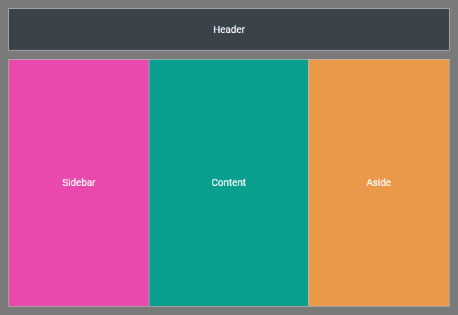

---
sidebar_label: Customization
title: Customization
---          

Styling Layout cells
----------------

There is a possibility to make changes in the look and feel of a layout by styling its cells. 

For this you need to take the following steps:

- add a new CSS class(es) with desired settings in the &lt;style&gt; section of your HTML page or in your file with styles (don't forget to include your file on the page in this case):

~~~html

~~~

- specify the name of the created CSS class (or names of classes separated by spaces) as the value of the [css](layout/api/layout_css_config.md) property in the configuration of a Layout cell:

~~~js
var layout = new dhx.Layout("layout_container",{
    row: [
		{
			header: "Sub Block Header row",
			css:"my_first_class my_second_class"
		}
    ]    
});
~~~

For example:

~~~js

var layout = new dhx.Layout("layout_container", {
	rows: [
    	{
        	id: "toolbar",
        	html: "Header",
        	css: "dhx_layout-cell--border_bottom layout-header",
        	gravity: false,
        	height: "60px"
		}
	]
});
~~~

{{editor	https://snippet.dhtmlx.com/pwxmf0lx	Layout. Custom Css}}