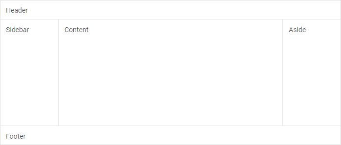

---
sidebar_label: Overview
title: Layout overview
description: dhtmlxLayout is a great tool for creating a user-friendly website with intuitive structure. The widget lets you combine diverse DHTMLX components and place various types of content on a page.
---          

dhtmlxLayout component lets you specify the main scheme of your application or web page, as it defines the arrangement of blocks with content. Layout helps blend diverse types of data representation on one page. 
Check [online samples for dhtmlxLayout](https://docs.dhtmlx.com/suite/samples/layout/).

## API reference

- 

## Related resources

- You can get dhtmlxLayout as a part of the Suite library by [downloading dhtmlxSuite](https://dhtmlx.com/docs/products/dhtmlxSuite/download.shtml)          
- There are also [online samples for dhtmlxLayout](https://docs.dhtmlx.com/suite/samples/layout/)  

## Guides

You can read the following articles to find out how to add Layout on the page and work with it.

- 
- 
- 
- 
- 

## Other

-
