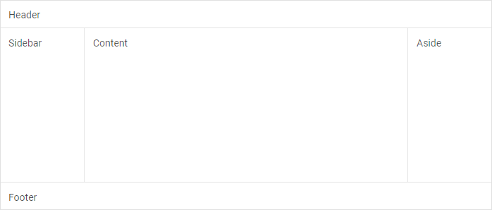

# Layout overview

DHTMLX Layout component lets you specify the main scheme of your application or web page, as it defines the arrangement of blocks with content. Layout helps blend diverse types of data representation on one page. 
Check [online samples for DHTMLX Layout](https://snippet.dhtmlx.com/f1f49n35?tag=layout).

## Features

You can check the following page to learn how to build a full-featured DHTMLX Layout:

- [Features](layout/features.md)

## API reference

- 

## Related resources

- You can get DHTMLX Layout as a part of the Suite library by [downloading DHTMLX Suite](https://dhtmlx.com/docs/products/dhtmlxSuite/download.shtml)
- There are also [online samples for DHTMLX Layout](https://snippet.dhtmlx.com/f1f49n35?tag=layout)  

## Guides

You can read the following articles to find out how to add Layout on the page and work with it.

- 
- 
- 
- 
- 
- 
- 

## Other

- 
