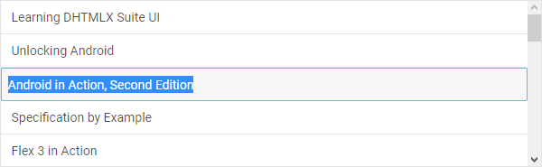
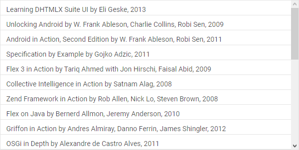
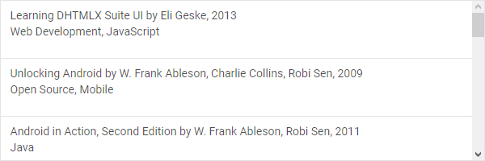
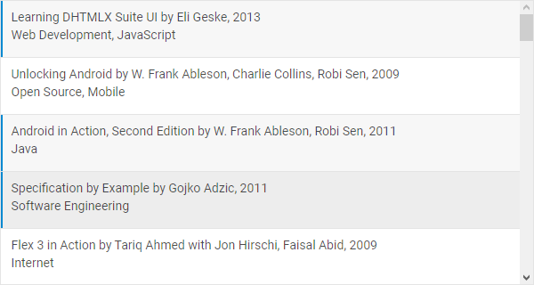
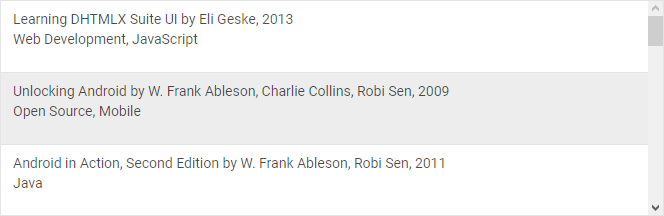
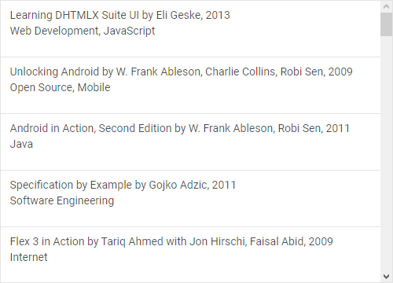

---
sidebar_label: Configuration
title: Configuration
description: description
---          

Arrow keys navigation
--------------------

The List component provides the possibility to navigate its items with arrow keys. You can enable this functionality using the [](list/api/list_keynavigation_config.md) property:

~~~js
var list = new dhx.List("list", {keyNavigation:true});
~~~

As a value of this option you can use either *true/false* to switch it on/off, or specify a *function* that will define some custom navigation logic.

### Default shortcut keys

<table class="webixdoc_links">
	<tbody>
        <tr>
			<td class="webixdoc_links0"><b>ArrowUp</b></td>
			<td>to move focus to the previous item</td>
		</tr>
        <tr>
			<td class="webixdoc_links0"><b>ArrowDown</b></td>
			<td>to move focus to the next item</td>
		</tr>
        <tr>
			<td class="webixdoc_links0"><b>Enter/Shift+Enter/Ctrl+Enter</b></td>
			<td>to add selection to a List item in focus</td>
		</tr>
        <tr>
			<td class="webixdoc_links0"><b>Ctrl+A</b></td>
			<td>to select all items at once (when the "multiselection" property is enabled)</td>
		</tr>
    </tbody>
</table>

Drag-n-drop of items
------------------

dhtmlxList supports drag-n-drop of items between lists in several modes. To begin with, you should specify the [](list/api/list_dragmode_config.md) property in the configuration object of List. Then define which mode you need:

- "target" - a list takes items from other lists, while its items can't be dragged out of it
- "source" - a list allows dragging its items out and can't take items from other lists
- "both" - a list both takes items from other lists and allows dragging its items out as well

~~~js
var list = new dhx.List("list_container", { 
    dragMode:"source"
});
~~~

In order to provide the possiblity of dragging several items between lists, you should enable the [](list/api/list_multiselection_config.md) in addition to the list/api/list_dragmode_config.md:

~~~js
var list = new dhx.List("list_container", { 
    dragMode:"source",
    multiselection:true
});
~~~

Read more about multiselection in List [below](#multipleselectionofitems).

{{editor	https://snippet.dhtmlx.com/yfz6ai7j	List. Setup Drag Mode}}

Dynamic rendering of items
----------------

All data is loaded into List and rendered at once. In case you use large amounts of data in the list, it may slow down the work of your app.

There is a possibility to increase the speed of your application containing a List by enabling dynamic data rendering. It presupposes that data is rendered by parts and on demand.
To make use of dynamic data rendering, switch the [](list/api/list_virtual_config.md) property on.

~~~js
var list = new dhx.List("list_container", { 
    virtual:true
});
~~~

{{editor	https://snippet.dhtmlx.com/x4gxy38e	List. Virtual List}}

Editing items
----------------



{{editor	https://snippet.dhtmlx.com/f26lfcai	List. Editable List}}

You can enable the possibility to edit List items with the help of the [](list/api/list_editable_config.md) configuration option:

~~~js
var list = new dhx.List("list_container", {editable:true});
~~~


Height of an item
----------------




{{editor	https://snippet.dhtmlx.com/89buovn2	List. Setup List Item Height}}

You can specify the necessary height of an item and set it before initialization of List via the [itemHeight](list/api/list_itemheight_config.md) property either as a number:

~~~js
// sets the height of an item as a number
var list = new dhx.List("list_container", { 
    itemHeight:30 /*!*/
});
~~~


or as a string value

~~~js
// sets the height of an item as a string value
var list = new dhx.List("list_container", { 
    itemHeight:"30px" /*!*/
});
~~~

{{note The usage of the *CSS calc() function* within the [](list/api/list_itemheight_config.md) property is not possible.}}

When the [virtual](list/api/list_virtual_config.md) property is set to *true*, the default height of a list item is 37. To change this value, make use of the **itemHeight** property, as described above.

Height of the List
---------------



{{editor	https://snippet.dhtmlx.com/k2mj2sz7	List. Setup List Height}}

You can define the desired height of a list via the [height](list/api/list_height_config.md) configuration option as easy as that:

~~~js
var list = new dhx.List("list", {height: 700});
~~~

You can also use a string value for setting the height of List:

~~~js
var list = new dhx.List("list", {height: "700px"});
~~~

{{note The usage of the *CSS calc() function* within the [](list/api/list_height_config.md) property is not possible.}}

Multiple selection of items
---------------------------



{{editor	https://snippet.dhtmlx.com/0sorkczm	List. List Multiselection}}

By default, you can select only one item in a list, since selection of another item resets selection of the previous one. To enable the possibility to select several List items, make use of the 
[](list/api/list_multiselection_config.md) configuration option:

~~~js
var list = new dhx.List("list", {multiselection:true});
~~~

Setting the **multiselection** property to *true* presupposes selection of multiple items by using Ctrl key.
It is also possible to use the "Ctrl+click" combination to select several items. For this, you need to set the 
[](list/api/list_multiselection_config.md) configuration option to *"ctrlClick"*:
~~~js
var list = new dhx.List("list", {
    multiselection:"ctrlClick"   
});
~~~

Selection of items
---------------------



[List. Disable Selection](https://snippet.dhtmlx.com/dk4czs1z)


The default configuration of List provides you with the selection feature that allows highlighting a List item. To disable selection in a List you need to set the [](list/api/list_selection_config.md) configuration property to *false*:

~~~js
var list = new dhx.List("list_container", {selection: false});
~~~

Template for List items
-------------------



{{editor	https://snippet.dhtmlx.com/gtzdwpj4	List. Add Template To List Item}}

You can define a template for rendering items in a List with the help of the [](list/api/list_template_config.md) configuration property. Set as its value a function that takes one parameter:

- **item** - (*object*) an object of a data item

~~~js

var list = new dhx.List("list", {
	css: "dhx_widget--bordered", 
    template: function(item) {
		var template = "<div class='list_item'>";
		template += "<div class='item_name'>"+item.value;
				
		template+="<span class='item_author'> by "
		template += item.authors.filter(function(item){return item}).join(", ");
		template += item.publishedDate ? ", " 
        template += new Date(item.publishedDate.$date).getFullYear() : "";
		template += "</span>";
		template += "</div>";
				
		template += "<div class='item_categories'>"+item.categories.join(", ")+"</div>";
		template += "</div>";
		return template;
	},
    itemHeight: 72
});
~~~

Event handlers for the template
-------------------------------

Starting from v7.0, it is possible to assign event handlers to HTML elements of a custom template of List items by using the [](list/api/list_eventhandlers_config.md) configuration option:

~~~js
function template(item) {
	let template = "<div class='list_item'>";
	template += "<div class='item_name'>"+item.value;
	template +="<span class='item_author'> by "
	template += item.authors.filter(function(item){return item}).join(", ");
	template += item.publishedDate ? ", " 
	template += new Date(item.publishedDate.$date).getFullYear() : "";
	template += "</span>";
	template += "</div>";
	template += "<span class='item_categories'>"+item.categories.join(", ")+"</span>";
	template += "</div>";
	return template;
}

const list = new dhx.List("list", {
	css: "dhx_widget--bordered",
	template: template,
	eventHandlers: { /*!*/
		onclick: { /*!*/
			list_item: function(event) { /*!*/
				display("You clicked on " + event.target.tagName); /*!*/
			}, /*!*/
		}, /*!*/
		onmouseover: { /*!*/
			list_item: function(event, id) { /*!*/
				display(list.data.getItem(id).value); /*!*/
			}, /*!*/
		} /*!*/
	} /*!*/
});
~~~

[List. Handling Events In Template](https://snippet.dhtmlx.com/7fyilbb7)

The [](api/list_eventhandlers_config.md) object includes a set of *key:value* pairs, where: 

``` todo это же есть на странице API, возможно не стоит дублировать
<table class="webixdoc_links">
	<tbody>
        <tr>
			<td class="webixdoc_links0"><i>key</i></td>
			<td> the name of the event. Note, that at the beginning of the event name the <b>'on'</b> prefix is used (onclick, onmouseover).</td>
		</tr>
        <tr>
			<td class="webixdoc_links0"><i>value</i></td>
			<td>an object that contains a <i>key:value</i> pair, where <i>key</i> is the css class name that the handler will be applied to and <i>value</i> is a function that takes two parameters:
            <ul>
                <li><b>event</b> - an event object</li>
                <li><b>id</b> - the id of a List item
            </ul></td>
		</tr>
    </tbody>
</table>

```