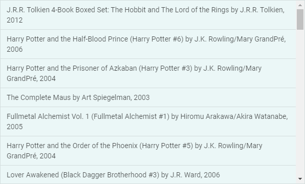
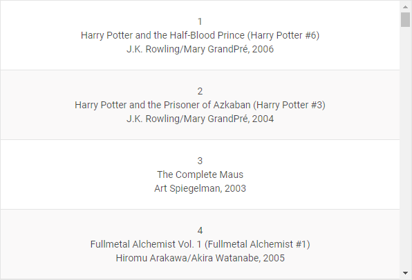
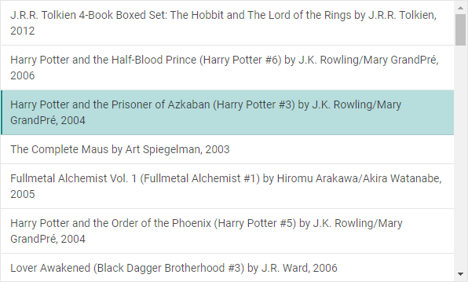

# Customization

## Styling

There is a possibility to make changes in the look and feel of a list. For this you need to take the following steps:

- add a new CSS class(es) with desired settings in the &lt;style&gt; section of your HTML page or in your file with styles (don't forget to include your file on the page in this case):

~~~html

~~~

- specify the name of the created CSS class (or names of classes separated by spaces) as the value of the [css](list/api/list_css_config.md) property in the List configuration:

~~~js
var list = new dhx.List({ 
    css:"my-first-class my-second-class"
});
~~~

**Related sample**: [List. Custom Styles](https://snippet.dhtmlx.com/s461f09w)

## Styling items

You can style particular cells in the list.

For example, apply some color to each even item, as in:

~~~js
var list = new dhx.List("list");
list.data.parse(dataset);

list.data.map(function (item, i) {
	if (!(i % 2)) {
		list.data.update(item.id, {css: "bg-gray"})
	}
})

~~~

**Related sample**: [List. Custom item Styles](https://snippet.dhtmlx.com/ipu9yshl)

## Adding custom selection

It is also possible to customize selection of an item.

**Related sample**: [List. Add Custom Selection With Custom Css](https://snippet.dhtmlx.com/6hss19d3)

~~~js

var list = new dhx.List("list");
list.data.parse(dataset);
 
list.data.map(function (item, i) {
	list.data.update(item.id, {css: "custom-class"})
});
~~~
