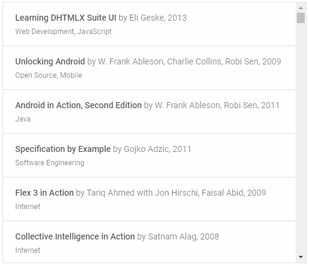

---
sidebar_label: Overview
title: List overview
description: dhtmlxList is a mobile-friendly JavaScript widget for rendering items in a list according to a user-defined template. Comprehensive and flexible API allows configuring your list easily  the way you need.
---          

dhtmlxList is a client-side JavaScript component that displays a collection of objects in a list according to a user-defined template.
It allows you to arrange multiple objects with similar properties within a single container and make your data organized. Check [online samples for dhtmlxList](https://docs.dhtmlx.com/suite/samples/list/). 

## API reference

- list/api/refs/list.md

## Related resources

- You can get dhtmlxList as a part of the Suite library by [downloading dhtmlxSuite](https://dhtmlx.com/docs/products/dhtmlxSuite/download.shtml)          
- There are also [online samples for dhtmlxList](https://docs.dhtmlx.com/suite/samples/list/)  

## Guides

-   	
- 
- 
- 
- 
- 
- 

## Other

-
