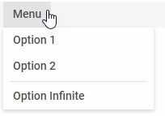
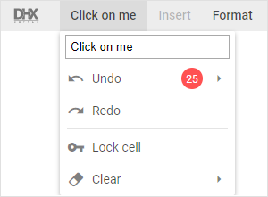
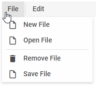
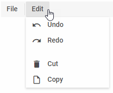

---
sidebar_label: List of Menu Controls
title: List of Menu Controls
---          

In this article you'll find the controls you can use in dhtmlxMenu. Their descriptions contain lists of attributes and examples of adding the controls into Menu on the fly.

To operate Menu controls, you can use Menu API and [Tree Collection API](tree_collection/api/refs/treecollection.md). Check the [related article](menu/work_with_menu.md).

MenuItem
-----------

MenuItem is a drop-down list of options.

### Adding menuItem

You can add a MenuItem control into the menu with the help of the **add()** method of Tree Collection:

~~~js
menu.data.add({
	type:"menuItem", value:"Menu", items:[
		{ type:"menuItem", value:"Option 1" },
		{ type:"menuItem", value:"Option 2" },
		{ type:"separator"},
		{ type:"menuItem", value:"Option Infinite" }
	]
});
~~~

{{editor	https://snippet.dhtmlx.com/qkxeer2h	Menu. Menu Item}}

#### Properties

See [the full list of properties](menu/api/api_menuitem_properties.md) that you can provide in the configuration object of a MenuItem control.

NavItem
----------

This is a default control for navigation-related components, can contain any other controls as nested items. 

### Adding NavItem

A navItem can be easily added to a menu with the help of the **add()** method of Tree Collection:

~~~js
menu.data.add({
    type:"navItem", value:"My NavItem"
});
~~~

{{editor	https://snippet.dhtmlx.com/uhv64cm7	Menu. Navigation Type}}

#### Properties

See [the full list of properties](menu/api/api_navitem_properties.md) that you can provide in the configuration object of a NavItem control.

### Adding an icon

A navItem can have an icon which is set through the corresponding option **icon**:

~~~js
{
    type:"navItem", value:"Some",
    icon:"dxi-check"
}
~~~

### Adding a badge with a number

You can add a number badge to the navItem to display information like the number of new messages. The badge is set via the **count** property:

~~~js
{
    type:"navItem", value:"Some",
    icon:"dxi-check",
    count:10
}
~~~

<h3 id="htmlcontent">Adding HTML content</h3>

You can add a custom image into the navItem with the help of the **html** property:

~~~js
{
    type: "navItem",
    id: "spline",
	html: ""
}
~~~

{{editor	https://snippet.dhtmlx.com/2hr77egx	Menu. Item HTML Content}}

### Showing/hiding a navItem

To hide/show a navItem, you should pass the ID of the navItem to the **hide() / show()** Menu methods:

~~~js
menu.show(id);
menu.hide(id);
~~~

### Enabling/disabling a navItem 

Any navItem in the menu can be enabled/disabled:

~~~js
menu.enable(id);
menu.disable(id);
~~~

## Custom HTML

This is an item that contains any custom HTML content (for example, an image, icon or other element).

### Adding Custom HTML

Any custom HTML content can be easily added to a menu with the help of the **add()** method of [Tree Collection](tree_collection/api/refs/treecollection.md):

~~~js
menu.data.add({
    id: "input",
	parent: "edit",
    type: "customHTML",
	html: "",
	css: "custom-image"
});
~~~

{{editor	https://snippet.dhtmlx.com/nk65jfmx	Menu. Custom HTML}}

#### Properties

See [the full list of properties](menu/api/api_customhtml_properties.md) that you can provide in the configuration object of a Custom HTML control.

Separator
------------

This is a horizontal (between menu options) or vertical (between menu items) line separating items/groups of items from each other.

### Adding Separator

A new Separator can be created with the help of the **add()** method of Tree Collection:

~~~js
menu.data.add({
	type:"separator"
});
~~~

{{editor	https://snippet.dhtmlx.com/71tybx5j	Menu. Separator}}

#### Properties

See [the full list of properties](menu/api/api_separator_properties.md) that you can provide in the configuration object of a Separator control.

Spacer
-----------

This item takes space on the toolbar and is used for aligning controls.

### Adding Spacer

A new Spacer can be created with the help of the **add()** method of Tree Collection:

~~~js
toolbar.data.add({
	type:"spacer"
});
~~~

{{editor	https://snippet.dhtmlx.com/fjaolual	Menu. Spacer}}

#### Properties

See [the full list of properties](menu/api/api_spacer_properties.md) that you can provide in the configuration object of a Spacer control.

@todo:
add links to api and to samples, complete the list of attrs for item
