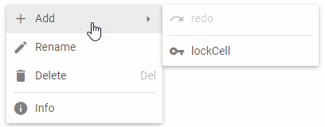

---
sidebar_label: Context Menu
title: Context Menu
---          

dhtmlxContextMenu is a component that provides an easy way to add a contextual menu to projects. It will be of great help for frequently used actions in web sites, help systems, etc.

{{editor	https://snippet.dhtmlx.com/mgya9p1l	Menu. Basic Context Menu Initialization}}

Initialization 
--------------

You can initialize dhtmlxContextMenu with the constructor:

~~~js
var cmenu = new dhx.ContextMenu(null, {css: "dhx_widget--bg_gray"});
~~~

It takes two parameters:

- *container* - optional, set it to *null*, since ContentMenu is created inside a popup
- *config* - optional, a configuration object. You can set the CSS classes to style a context menu here 

Loading menu options
---------------

Like with dhtmlxMenu, options can be either parsed from a JSON array:

~~~js
var data = [
    { value: "File", 
        items: [
            { value: "New File", icon: "dxi dxi-file-outline"},                      
            { value: "Remove File", icon: "dxi dxi-delete"}        
        ]
    },
    {
        type: "separator"
    },
    { value: "Edit",
        items: [
            { value: "Undo", icon: "dxi dxi-undo"},
            { value: "Redo", icon: "dxi dxi-redo"}
         ]
    },
    {
        type: "spacer"
    }
];

cmenu.data.parse(data);
~~~

or loaded from a JSON file:

~~~js
cmenu.data.load("[path_to_file]/file.json");
~~~

Showing dhtmlxContextMenu
-------------------

dhtmlxContextMenu is attached to a context zone, and can be shown with the **showAt()** method. It takes two parameters:

<table class="webixdoc_links">
	<tbody>
        <tr>
			<td class="webixdoc_links0"><b>element</b></td>
			<td>(<i>HTMLElement|Event|string</i>) the element that will be a context zone: an HTML object/its id/a mouse event</td>
		</tr>
        <tr>
			<td class="webixdoc_links0"><b>mode</b></td>
			<td>(<i>string</i>) optional, the position of showing a context menu relative to the context zone: "bottom"|"right". By default a context menu is shown at the point where the mouse pointer is.</td>
		</tr>
    </tbody>
</table>

### Attaching to HTML object

This is how you can attach dhtmlxContextMenu to an HTML element:

~~~html

~~~

~~~js
var cmenu = new dhx.ContextMenu(null, {css: "dhx_widget--bg_gray"});

document.querySelector('#menu').oncontextmenu = function(e) {    
    e.preventDefault();
    cmenu.showAt('menu', 'right');
}
~~~

- **e** is the mouse event.

### Attaching to a mouse event 

This is how you can attach dhtmlxContextMenu to a mouse event:

~~~js
var cmenu = new dhx.ContextMenu(null, {css: "dhx_widget--bg_gray"});

document.querySelector('#menu').oncontextmenu = function(e) {   
    e.preventDefault();
    cmenu.showAt(e);
}
~~~
