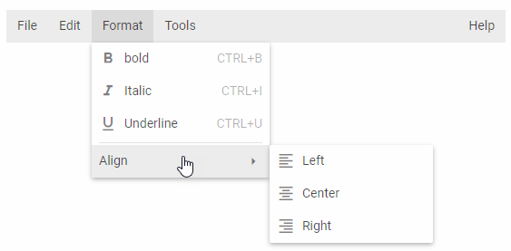

# Menu overview

DHTMLX Menu is a component that provides an easy way to add a drop down menu to user's projects. This component is highly customizable and supports a wide range of features. DHTMLX Menu component can be a good navigation aid to web sites, help systems, etc. Check [online samples for DHTMLX Menu](https://snippet.dhtmlx.com/all?tag=menu).

## Features

You can check the following page to learn how to build a full-featured DHTMLX Menu:

- [Features](menu/features.md)

## API reference

- 

## Related resources

- You can get DHTMLX Menu as a part of the Suite library by [downloading DHTMLX Suite](https://dhtmlx.com/docs/products/dhtmlxSuite/download.shtml)
- There are also [online samples for DHTMLX Menu](https://snippet.dhtmlx.com/all?tag=menu)
- To work with data of Menu check [TreeCollection API](tree_collection.md)

## Guides

You can read the following articles to find out how to add Menu on the page and work with it.

- 
- 
- 
- 
- 
- 
- 
