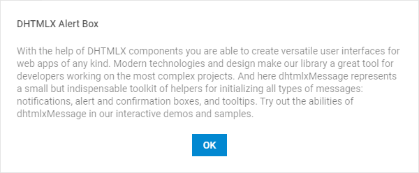
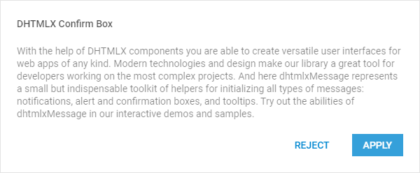
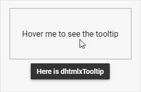
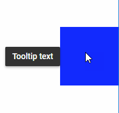

---
sidebar_label: Configuration
title: Configuration
description: description
---          

In this article you will find the detailed list of properties that you can use inside the constructors of message boxes and tooltip to adjust their configuration.

## Message Box

{{editor	https://snippet.dhtmlx.com/rsxdlicg	Message. Show Message}}

The constructor of a message box may take [the following parameters](message/api/api_message_properties.md).

~~~js
dhx.message({
    text:"Message text", 
    icon:"dxi-clock", 
    css:"expire", 
    expire:1000
});
~~~

{{editor	https://snippet.dhtmlx.com/qfmd877x	Message. Message Configuration}}

## Alert Box

{{editor	https://snippet.dhtmlx.com/m4xka888	Message. Show Alert}}

The constructor of an alert box may take [the following parameters](message/api/api_message_properties.md#alert-box).

~~~js
dhx.alert({
    header:"Alert Header",
    text:"Alert text",
    buttonsAlignment:"center"
});
~~~

{{editor	 https://snippet.dhtmlx.com/dk4a7959	Message. Alert And Confirm Configuration}}

## Confirm Box

{{editor	https://snippet.dhtmlx.com/iss7twe6	Message. Show Confirm}}

The constructor of a confirm box may take [the following parameters](message/api/api_message_properties.md#confirm-box).

~~~js
dhx.confirm({
    header:"Confirm Header",
    text:"Confirm text",
    buttons:["cancel", "apply"],
    buttonsAlignment:"center"
});
~~~

{{editor	 https://snippet.dhtmlx.com/dk4a7959	Message. Alert And Confirm Configuration}}

### Working with confirm

To find out which button was pressed, use the callback function that returns a Promise:

~~~js
dhx.confirm({
	header: "confirm the action",
	text: "can you apply?",
	buttons: ["cancel", "apply"]
}).then(function(answer){
	if (answer){
		console.log("confirmed")
	}
	else {
		console.log("cancelled")
	}
});
~~~

## Tooltip

{{editor	https://snippet.dhtmlx.com/c6jm8if6	Message. Show Tooltip}}

The constructor of a tooltip may take [the following parameters](message/api/api_message_properties.md#tooltip).
~~~js
dhx.tooltip("Tooltip From Right", {
	node: "fourth", 
    position: "right"
});
~~~

{{editor	https://snippet.dhtmlx.com/4wrrsr67	Message. Tooltip Position}}

{{editor	https://snippet.dhtmlx.com/zts0avym	Message. Tooltip Delay Configuration}}

### Smart positioning

{{note If the target of the tooltip is placed close to some edge of the browser, the tooltip will be shown from the opposite side of the target.}}

In the image below the target is adjacent to the right side of screen. Its tooltip that has the *position:"right"* attribute in the config object appears from the left side of the target.

### Tooltip API

You can control the activity of the Tooltip via the pair of methods.

- to switch the tooltip off, use the **disableTooltip()** method:

~~~js
dhx.disableTooltip();
~~~

- to switch the tooltip on again, apply the **enableTooltip()** method:

~~~js
dhx.enableTooltip();
~~~

