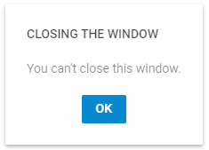

---
sidebar_label: Overview of Message Boxes
title: Overview of Message Boxes
description: description
---          

dhtmlxMessage component provides a set of helper message boxes: message, alert, confirm, and the tooltip component. Message boxes are easily configurable, so that you can achieve the best look and feel for 
interaction with the users of your app or web-site.

Message
------------

A simple message box to inform a user about processes occurring in the application in this or that moment.

Alert 
-------------

This type of message box allows warning a user against taking some steps that may lead to unexpected or undesirable result.

Confirm
----------

This type of message box is useful when you need to ask a user to confirm some action to proceed to next steps.

Tooltip
------------

Tooltip is a great helper for giving information about an element a user is hovering over.
