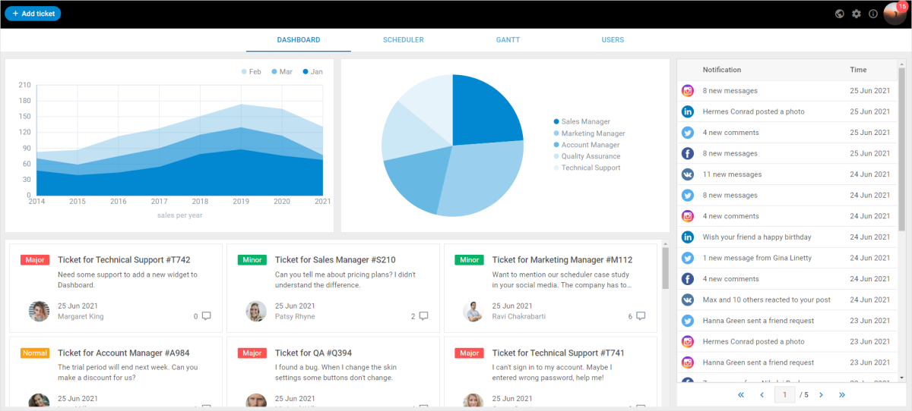

---
sidebar_label: Dashboard Framework demo
title: Dashboard Framework demo
--- 

This demo application shows how to create a dashboard for a ticketing system based on DHTMLX Suite widgets: Layout, Grid, DataView, Toolbar, Chart, Window, and Form.

## How to download

Open the [DHTMLX JavaScript Demos](https://dhtmlx.com/docs/products/demoApps/) page. Here you can find demo applications made with DHTMLX. Choose UI Dashboard and click on it. Here is the direct way to the [UI Dashboard demo](https://dhtmlx.com/docs/products/demoApps/dhtmlxDashboard/#dashboard) page.

Tip: Use the navigation arrows at the left bottom corner of the page to surf all the demos.

Click the Download Demo button at the right bottom corner.

Complete the form to start the download. The email with the download link will be sent to you.

Follow the link in the email to get a free 30-day trial version. You will receive a .zip file with the UI Dashboard demo. Save the file and unpack it to your working directory.

## How to start

Follow the instruction in the README.md file to run the demo.

## Demo overview

The interactive UI Dashboard demo framework shows you how to build comprehensive dashboards for enterprise software and other web apps. Here you can see an example of a CRM system based on DHTMLX widgets. DHTMLX Gantt and DHTMLX Scheduler are also parts of the demo. The demo is interactive – check how it works. You can add new tickets, change the schedule, and manipulate the Gantt diagram.

We used the DHTMLX Optimus framework to create the UI Dashboard demo. The components of the demo are divided into Views. You can initialize or modify each component separately. Any component can be removed. The demo can be taken as a View itself and become a component of another app.

There are no specific backend requirements. The demo is based on the REST API and you can use any backend platform which supports it (PHP, Nodejs, .Net, Java, etc.).

## License

The free trial version is given to you for 30 days only for evaluation purposes. After a trial term is over, you will receive messages about using an unlicensed product.

Learn more about [Evaluation License Terms](https://dhtmlx.com/docs/products/license.shtml?eval). `check`

### How to start with license

If you would like to use this demo in your project after the evaluation period expires, you should purchase the DHTMLX Suite PRO Edition license. You will need to replace the .js and .css files of the evaluation version with the licensed files of DHTMLX Suite to be able to work with the demo after the purchase.

Please have a look at the available [license types](https://dhtmlx.com/docs/products/licenses.shtml) for more information.
