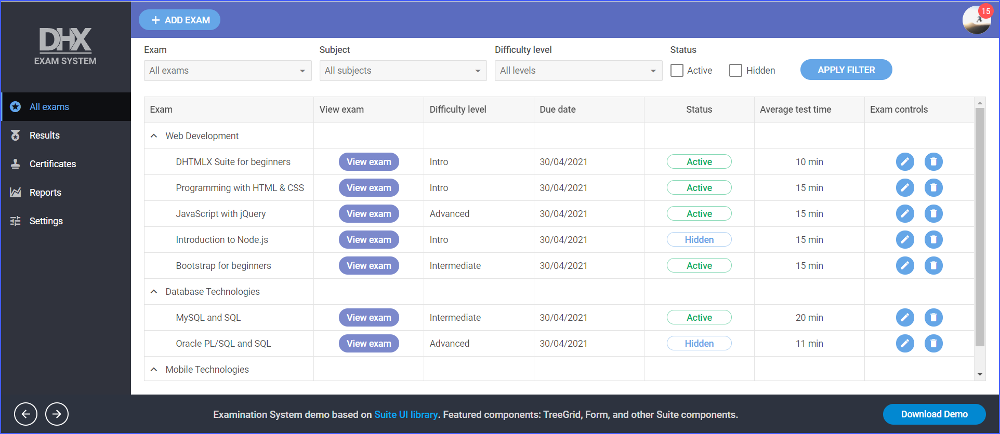

# Online Exam System Demo

[comment]: # (todo добавить ссылку на демку на картинку и под картинкой)

This demo application shows how to create an online examination system for an educational project with subjects, exams, and students' results. It is developed using DHTMLX Suite widgets: TreeGrid, Form, Sidebar, and Toolbar.

## How to download

Open the [DHTMLX JavaScript Demos](https://dhtmlx.com/docs/products/demoApps/) page. Choose Online Exam System and click on it. Also, you can go directly to the [Online Exam System](https://dhtmlx.com/docs/products/dhtmlxOnlineExam/) overview page or the [Online Exam System demo](https://dhtmlx.com/docs/products/demoApps/dhtmlxExam/#exams) page.

The Download Demo button on both pages will start downloading process of the demo app.

Complete the form to start the download. The email with the download link will be sent to you.

Follow the link in the email to get a free 30-day trial version. You will receive a .zip file with the Online Exam System demo. Save the file and unpack it to your working directory.

## How to start

Follow the instruction in the README.md file to run the demo.

## Demo overview

The Online Exam System is ready to use solution for online examination. You can create an online exam using the Form in the demo app in several steps. Also, it is possible to modify the Form very easily to your need. The TreeGrid widget is used to manage the examination process.

The Online Exam System demo is built with the help of the DHTMLX Optimus framework. The components of the demo are divided into Views. You can initialize or modify each component separately. Any component can be removed. The demo can be taken as a View itself and become a component of another app.

The solution you can see has no requirements for the backend. It is based on the REST API and you can use any backend platform which supports it (PHP, Nodejs, .Net, Java, etc.).

## License

The free trial version is given to you for 30 days only for evaluation purposes. After a trial term is over, you will receive messages about using an unlicensed product.

Learn more about [Evaluation License Terms](https://dhtmlx.com/docs/products/license.shtml?eval). `check`

### How to start with license

If you would like to use this demo in your project after the evaluation period expires, you should purchase the DHTMLX Suite PRO Edition license. You will need to replace the .js and .css files of the evaluation version with the licensed files of DHTMLX Suite to be able to work with the demo after the purchase.

Please have a look at the available [license types](https://dhtmlx.com/docs/products/licenses.shtml) for more information.
