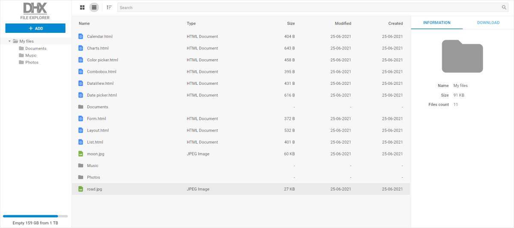

# File Manager Demo

[comment]: # (todo добавить ссылку на демку на картинку и под картинкой)

This demo application shows how to create a Material-style file manager app based on DHTMLX Suite widgets: Grid, Tree, Layout, DataView, Toolbar, Sidebar, Menu, Form, and Tabbar.

## How to download

Open the [File Manager](https://dhtmlx.com/docs/products/demoApps/dhtmlxFileExplorerDemo/) demo and click the Download Demo button in the bottom right corner of the page.

Complete the form to start the download. The email with the download link will be sent to you.

Follow the link in the email to get a free 30-day trial version. You will receive a .zip file with the File Manager demo. Save the file and unpack it into your working directory.

You can find more demos on the [DHTMLX JavaScript Demos](https://dhtmlx.com/docs/products/demoApps/) page. To view the desired one, just click on it.

## How to start

To run the demo, follow the instructions given in the README.md file.

## Demo overview

The file manager demo is a handy way to work with files of any size. You can easily integrate the demo into your project and modify it according to your needs.

The file manager demo is built on the base of the DHTMLX Optimus framework. The components of the demo are divided into Views. You can initialize or modify each component separately. Any component can be removed. The demo can be taken as a View itself and become a component of another app.

There are no specific backend requirements. The demo is based on the REST API and you can use any backend platform which supports it (PHP, Nodejs, .Net, Java, etc.).

For more information, see [JavaScript/HTML5 File Manager](https://dhtmlx.com/docs/products/dhtmlxFileManager/).
## License

A free 30-day trial version of the demo is provided to you only for evaluation purposes. You will be able to learn more about *Evaluation License Terms* when filling the form to download the demo.

After the trial period is over, you will receive messages about using an unlicensed product.

### How to start with license

If you want to use this demo in your project after the evaluation period expires, you will need to purchase the DHTMLX Suite PRO Edition license.
Please have a look at the available [license types](https://dhtmlx.com/docs/products/licenses.shtml) for more information.

After the purchase, you will need to replace the .js and .css files of the evaluation version with the licensed files of DHTMLX Suite.
