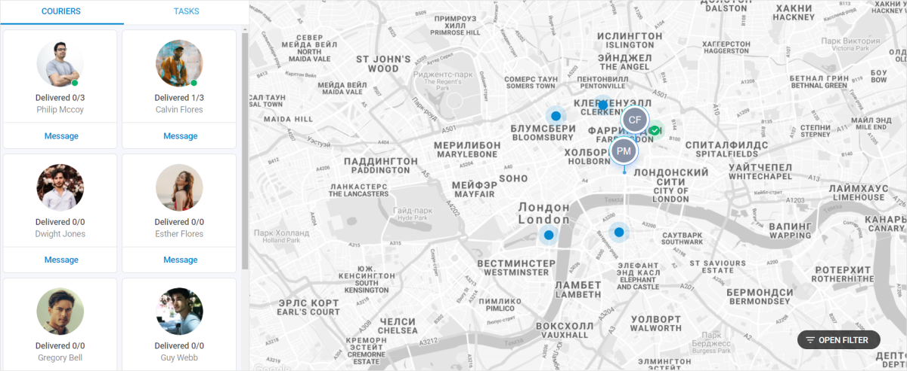

---
sidebar_label: Geo tracking demo
title: Geo Tracking Demo
--- 

This demo shows how to create a geo tracking application for delivery management. It is developed using DHTMLX Suite widgets: Layout, Sidebar, Tabbar, Form, and Dataview.

## How to download

Open the [DHTMLX JavaScript Demos](https://dhtmlx.com/docs/products/demoApps/) page. Here you can find demo applications made with DHTMLX. Choose Geo Tracking and click on it. Here is the direct way to the [Geo Tracking demo](https://dhtmlx.com/docs/products/demoApps/dhtmlxGeoTracking) page.

Tip: Use the navigation arrows at the left bottom corner of the page to surf all the demos.

Click the Download Demo button at the right bottom corner.

Complete the form to start the download. The email with the download link will be sent to you.

Follow the link in the email to get a free 30-day trial version. You will receive a .zip file with the Geo Tracking demo. Save the file and unpack it to your working directory.

## How to start

Follow the instruction in the README.md file to run the demo. Enjoy a nice and easy to modify solution build on the DHTMLX Optimus framework.

## Demo overview

The Geo Tracking demo is created to check and manage and the delivery process in real-time. The Tracking system is integrated with Google Maps and shows real-time geolocation of couriers. You can visualize the information you need with a help of a Form. Geo Tracking is a nice and easy solution for business. Check it in a live demo.

We used the DHTMLX Optimus framework to create the Geo Tracking demo. The components of the demo are divided into Views. You can initialize or modify each component separately. Any component can be removed. The demo can be taken as a View itself and become a component of another app.

There are no specific backend requirements. The demo is based on the REST API and you can use any backend platform which supports it (PHP, Nodejs, .Net, Java, etc.).

## License

A free 30-day trial version is provided only for evaluation purposes. After a trial term is over, you will receive messages about using an unlicensed product.

Learn more about [Evaluation License Terms](https://dhtmlx.com/docs/products/license.shtml?eval). `check`

### How to start with license

If you would like to use this demo in your project after the evaluation period expires, you should purchase the DHTMLX Suite PRO Edition license. You will need to replace the .js and .css files of the evaluation version with the licensed files of DHTMLX Suite to be able to work with the demo after the purchase.

Please have a look at the available [license types](https://dhtmlx.com/docs/products/licenses.shtml) for more information.
