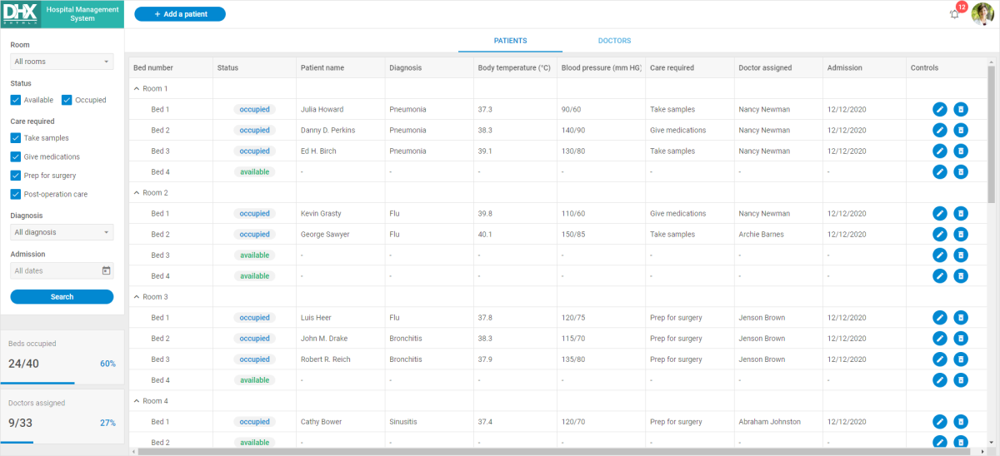

# Hospital Management System Demo

[comment]: # (todo добавить ссылку на демку на картинку и под картинкой)

This demo application shows how to create a hospital management system with a clear and accurate UI based on DHTMLX Diagram and DHTMLX Suite widgets: Sidebar, TreeGrid, Tabbar, Dataview, Window, Toolbar, and Form.

## How to download

Open the [Hospital Management System](https://dhtmlx.com/docs/products/demoApps/dhtmlxHospital/#patients) demo and click the Download Demo button in the bottom right corner of the page.

Complete the form to start the download. The email with the download link will be sent to you.

Follow the link in the email to get a free 30-day trial version. You will receive a .zip file with the File Manager demo. Save the file and unpack it into your working directory.

You will find more demos on the [DHTMLX JavaScript Demos](https://dhtmlx.com/docs/products/demoApps/) page. To view the desired one, just click on it.

## How to start

To run the demo, follow the instructions in the README.md file.

## Demo overview

The hospital management system demo is a complex solution to show you how DHTMLX widgets can be organized and what components they have on board. You can use the demo to build your management system easily.

Pay attention to how the Patient Registration Form is realized. Here you can find built-in Datepicker, Combobox, Input fields, RadioGroup controls, and even more.

Treegrid is the main widget of the demo. With the help of it, you can manage the hospital in real-time. Tabbar helps you to organize the information in the Treegrid in a convenient way.

DHTMLX diagram is one more feature of the demo. It helps to visualize a hospital management hierarchy.

For more details, check [Hospital Management System in JavaScript](https://dhtmlx.com/docs/products/dhtmlxHospitalManagement/).

## License

A free 30-day trial version of the demo is provided to you only for evaluation purposes. You can read more about *Evaluation License Terms* when filling the form to download the demo.

After the trial period is over, you will receive messages about using an unlicensed product.

### How to start with license

If you want to continue to use this demo in your project after the evaluation, you have to purchase the DHTMLX Suite PRO Edition license. Please have a look at the available [license types](https://dhtmlx.com/docs/products/licenses.shtml) for more information.

You will need to replace the .js and .css files of the evaluation version with the licensed files of DHTMLX Suite to be able to work with the demo after the purchase.