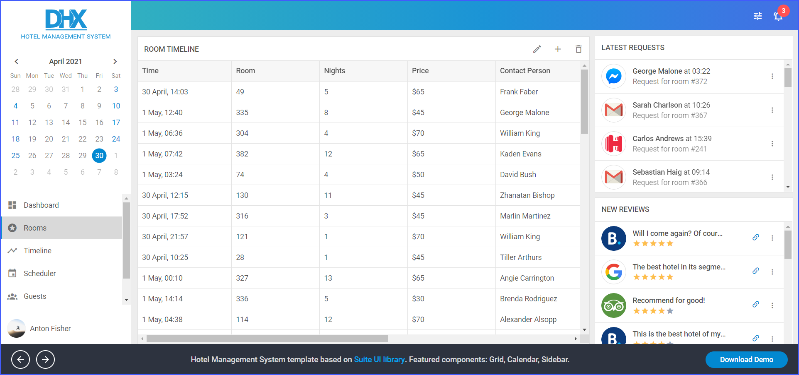

---
sidebar_label: Hotel management system demo
title: Hotel Management System Demo
--- 

[comment]: # (todo добавить ссылку на демку на картинку и под картинкой)

This demo shows how to create a hotel management system based on DHTMLX Suite widgets: Layout, Grid, List, Toolbar, Sidebar, and Calendar.

## How to download

Open the [Hotel Management System](https://dhtmlx.com/docs/products/demoApps/dhtmlxHotelManagement/#rooms&date=2021-04-30) demo and click the Download Demo button in the bottom right corner of the page.

Complete the form to start the download. The email with the download link will be sent to you.

Follow the link in the email to get a free 30-day trial version. You will receive a .zip file with the File Manager demo. Save the file and unpack it into your working directory.

You will find more demos on the [DHTMLX JavaScript Demos](https://dhtmlx.com/docs/products/demoApps/) page. To view the desired one, just click on it.

## How to start

To run the demo, follow the instructions given in the README.md file.

## Demo overview

The HTML/JavaScript hotel management system demo helps you to understand how to build a user-friendly solution for hotel management with the help of the DHTMLX Suite library.

One of the main components of the project is Grid. You can add multiline headers and footers, set frozen columns, apply column editors such as a checkbox or combobox, and much more. Please check all the possibilities – the demo is interactive. Pay attention to all widgets in it.

Layout, Grid, List, Toolbar, Sidebar, and Calendar are integrated with the help of the DHTMLX Optimus framework. The solution has no requirements for the backend. It is based on the REST API and you can use any backend platform which supports it (PHP, Nodejs, .Net, Java, etc.).

For more details, check [GUI for Hotel Management System](https://dhtmlx.com/docs/products/dhtmlxHotelManagement/).

## License

A free 30-day trial version of the demo is given to you only for evaluation purposes. You can read more about *Evaluation License Terms* while filling the form to download the demo.

After the trial period is over, you will receive messages about using an unlicensed product.

### How to start with license

If you want to use this demo in your project after the evaluation, you will need to purchase the DHTMLX Suite PRO Edition license. Have a look at the available [license types](https://dhtmlx.com/docs/products/licenses.shtml) for more information.

You will need to replace the .js and .css files of the evaluation version with the licensed files of DHTMLX Suite to be able to work with the demo after the purchase.

