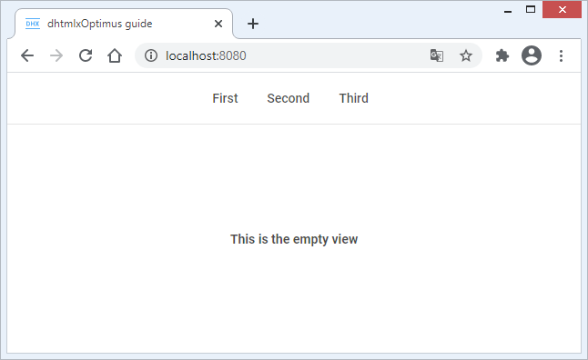
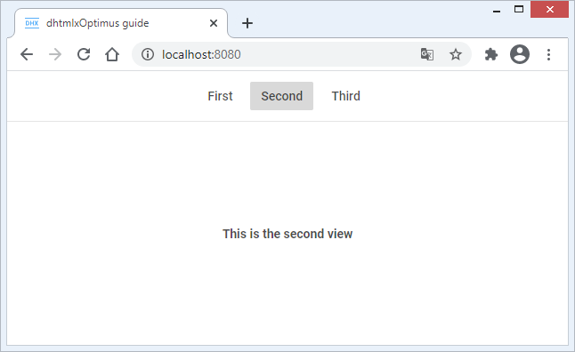
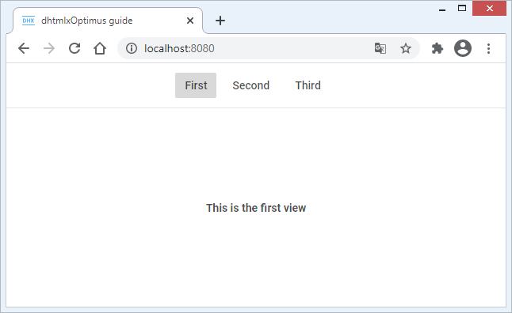
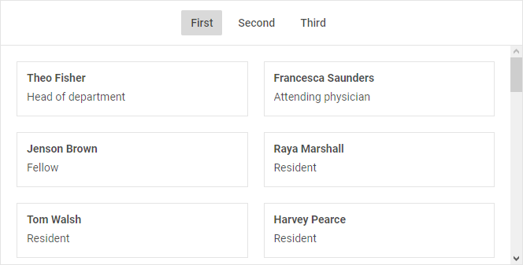
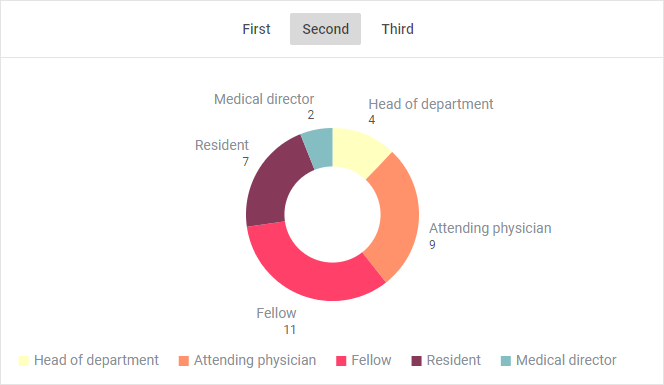
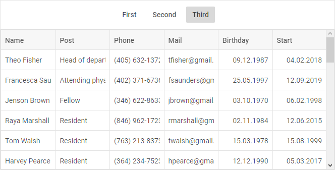
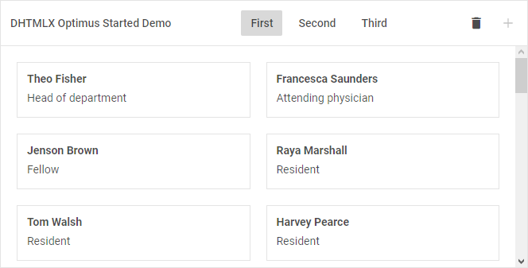
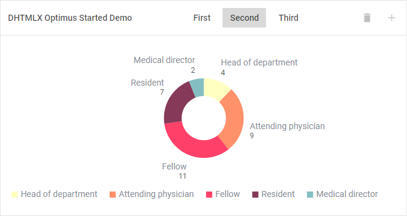
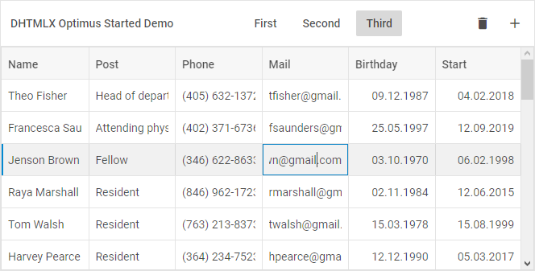

---
sidebar_label: How to start with Optimus
title: How to start with Optimus
---  

This guide gives you step-by-step instructions on how to create a simple application with lightweight JavaScript UI Framework.

The guide will teach you how to create your own views on the base of DHTMLX Optimus using DHTMLX Suite. You will also learn how to implement exchange of data between the views and components from any point of the application. 

{{note The complete source code is available on <a href="https://github.com/DHTMLX/optimus-starter-app/tree/guide/step-5" target="_blank">GitHub</a>. You can check the step-by-step changes by switching between the branches with the related names.}}

For more information about working with the components of DHTMLX Suite, see **DHTMLX documentation**. The detailed information on DHTMLX Optimus is presented [here](optimus_guides/index.md).

So, let's get started! 

Configure the environment
------------------------

### Preparing the environment

In this tutorial we'll work with the <a href="https://github.com/DHTMLX/optimus-starter-app/" target="_blank">environment</a> that we've already configured using <a href="https://webpack.js.org" target="_blank">webpack</a>. 

The whole project structure will be as follows:

~~~html
optimus_demo_guide
|── build/
└── src/
   |── assets/
   |── static/
   |── views/
   |── index.html
   └── index.js	
~~~

- **root** directory - contains files with configurations of the project and environment
- **build/** folder - contains scripts for running webpack
- **src/** folder - includes sources for the application's functioning
- **src/index.js** - the entry point of the application
- **views/** folder - stores files with views. We recommend to have a single view per file.

### Adding the dependencies

To begin with, download the <a href="https://github.com/DHTMLX/optimus-starter-app/tree/guide/step-1" target="_blank">initial project from GitHub</a>. After unzipping the project, you should install the dependencies in the *package.json* file with the following command:

~~~js
npm install
~~~

To run the project on the local server, use:

~~~js
npm start
~~~

Step 1. Initialize an application
--------------------------------

{{note The full code for Step 1 is available on <a href="https://github.com/DHTMLX/optimus-starter-app/tree/guide/step-1" target="_blank">GitHub</a>. }}

After running the <a href="https://github.com/DHTMLX/optimus-starter-app/tree/guide/step-1" target="_blank">project</a> on the local server and opening *http://localhost:8080/* in your browser, you will see the following result:

Let's consider how we've initialized our starter application:

1\. First, we've created a new *index.html* file in the *src* folder and defined a container to render our app there: 

~~~html title="index.html"
<!DOCTYPE html>
<html lang="en">
	<head>
		<title>dhtmlxOptimus guide</title>
	</head>
	<body>
		<!-- Create a container with the unique id -->
		<section id="app" class="main__container"></section>
	</body>
</html>
~~~

2\. Next, we've created an *index.js* file - the entry point of the app.  

~~~js title="src/index.js"
// import css styles
import "./assets/css/index.css"; 
// import the App class from the "dhx-optimus" library
import { App } from "dhx-optimus";

export class MyApp extends App {}
~~~

Here we've created the MyApp class that will render our application. The MyApp class is inherited from the App class. 

For details about css styles used for the app, see the <a href="https://github.com/DHTMLX/optimus-starter-app/blob/guide/step-1/src/assets/css/index.css" target="_blank">index.css</a> file.

3\. After that, we've added our first View with a simple text. For that, we've created the *TopLayout.js* file in the *views* folder. 

{{note We recommend that you use the capital letter at the beginning of the name of the file that have a view => TopLayout.js. This is the common practice.}}

~~~js title="src/views/TopLayout.js"
// import the View class from the "dhx-optimus" library
import { View } from "dhx-optimus";

export class TopLayout extends View {
	init() {
		return `<h1>Hello Optimus!</h1>`;
	}
}
~~~

As you can see, we've created the TopLayout class that is inherited from the View class. To define the initial view, we've returned an HTML element in the **init()** method. 

4\. Then, to render the just created view, we've included the view into the *index.js* file and rendered it via the **show()** method:

~~~js title="src/index.js"
import "./assets/css/index.css";

import { App } from "dhx-optimus";
import { TopLayout } from "./views/TopLayout"; /*!*/

export class MyApp extends App {
	init() { /*!*/
		this.show(null, TopLayout); /*!*/
	} /*!*/
}
~~~

You can find more details on API methods [here](optimus_guides/index.md#api).

5\. Finally, we've initialized our application via updating the code of the *index.html* file with the following:

~~~html
<!DOCTYPE html>
<html lang="en">
	<head>
		<title>dhtmlxOptimus guide</title>
		<!-- Suite -->
		
		<link rel="stylesheet" href="https://cdn.dhtmlx.com/suite/edge/suite.css" />
		<!-- App -->
		
		<link rel="stylesheet" href="./app.css" />
	</head>
	<body>
		<section id="app" class="main__container"></section>
		
	</body>
</html>
~~~

Everything is pretty straightforward here:

- we've included a free version of DHTMLX from our CDN. It is necessary to include files of DHTMLX Suite as dependencies for correct work of DHTMLX Optimus;
- we've included the *app.js* and *app.css* files to configure webpack;
- we've initialized the app via the **render()** method that takes the ID of the container as a parameter.

Here you are! Now, you can move forward and add the code from the further steps into the code of the initial project that we've just explored.

Step 2. Add views using DHTMLX Suite
--------------------

{{note The full code for Step 2 is available on <a href="https://github.com/DHTMLX/optimus-starter-app/tree/guide/step-2" target="_blank">GitHub</a>.}}

Let's move on and create several views using widgets of the DHTMLX Suite library. We'll also explore the global event bus that we'll apply to switch between the created views.

### Adding the Toolbar view

Firstly, we'll create the view on the base of the DHTMLX Toolbar widget because we need the toolbar to switch between the views in our app. For that, create the *ToolbarView.js* file in the *views* folder and fill it with the following code:

~~~js title="src/views/ToolbarView.js"
import { View } from "dhx-optimus";

export class ToolbarView extends View {
	init() {
		this.toolbar = new dhx.Toolbar(null, {
			css: "toolbar",
			data: [
				{
					type: "spacer",
				},
				{
					id: "first",
					value: "First",
					group: "views",
				},
				{
					id: "second",
					value: "Second",
					group: "views",
				},
				{
					id: "third",
					value: "Third",
					group: "views",
				},
				{
					type: "spacer",
				},
			],
		});

		return this.toolbar;
	}
}
~~~

The code is quite simple:

- We've configured DHTMLX Toolbar in the **init()** method. The method returns the toolbar as a view. 
- **Note**, that when using DHTMLX widgets as a view, the container where the component will be rendered must be specified to `null`.

### Adding the child view

Now, you should create a child view. The component will render the current id of the button selected in the toolbar. Navigate to the *views* folder and create the *EmptyView.js* file with the following content:

~~~js title="src/views/EmptyView.js"
import { View } from "dhx-optimus";

export class EmptyView extends View {
	init() {
		return `
		

			This is the ${this.params.content || "empty"} view
		
`;
	}
}
~~~

The child component will get the id via `params`.

### Rendering views

To render the created *EmptyView* and *ToolbarView* views, update the *Toplayout.js* file with the following code:

~~~js title="src/views/Toplayout.js"
import { View } from "dhx-optimus";

import { ToolbarView } from "./ToolbarView";
import { EmptyView } from "./EmptyView";

export class TopLayout extends View {
	init() {
		return (this.layout = new dhx.Layout(null, {
			rows: [
				{
					id: "toolbar",
					height: "content",
					init: cell => this.show(cell, ToolbarView),
				},
				{
					id: "content",
					init: cell => this.show(cell, EmptyView),
				},
			],
		}));
	}
}
~~~

In the above code we've returned Layout as a view and placed the *EmptyView* and *ToolbarView* views into the cells of the layout. 

To render the views, the **show()** method is called. For details about rendering of the components of the DHTMLX Suite library, see the [documentation](optimus_guides/index.md#initialization-of-the-dhtmlx-layout-component).

But, if you've already run your app, you can notice that nothing happens when switching the buttons in the toolbar. To solve this problem, we need to add global events.

### Adding the global event bus

Adding global events is the best way to implement exchanging of data between the components. 

Open the *ToolbarView.js* file and apply the **ready()** method to add the *click* event handler of the toolbar.

~~~js title="src/views/ToolbarView.js"
import { View } from "dhx-optimus";

export class ToolbarView extends View {
	init() {
		...
	}

	ready() {
		this.toolbar.events.on("click", id => {
			this.fire("viewChange", [id]);
		});
	}
}
~~~

We've defined the global *viewChange* event inside the *click* event via the **fire()** method. The logic is the following: whenever the user clicks the button in the toolbar, the *viewChange* event will fire.

Now, we need to update the *TopLayout* view where we'll listen to the *viewChange* event:

~~~js title="src/views/TopLayout.js"
import { View } from "dhx-optimus";

import { ToolbarView } from "./ToolbarView";
import { EmptyView } from "./EmptyView";

export class TopLayout extends View {
	init() {
		...
	}

	ready() {
		// initialize the global event handler
		this.on("viewChange", id => {
			this.show(this.layout.getCell("content"), EmptyView, { content: id });
		});
	}
}
~~~

As you can see from the above code, we've initialized the global **viewChange** event handler. 

Now, we'll follow the changes in the global event bus. Each time the user clicks the button in the toolbar, the **show()** method will re-render the *EmptyView* view and pass the id of the selected button to it.

Let's take a look at the result:

After clicking on the "Second" button you should see the view, as in:

You can also learn more details about how to:

- [pass parameters to child components](optimus_guides/index.md#passing-data-to-child-components);
- [use global event bus](optimus_guides/index.md#subscribing-to-global-events); 
- [work with the DHTMLX Suite library in views](optimus_guides/index.md#working-with-widgets-of-suite).

Step 3. Define the global state of the app
--------------------------------

{{note The full code for Step 3 is available on <a href="https://github.com/DHTMLX/optimus-starter-app/tree/guide/step-3" target="_blank">GitHub</a>.}}

For now, you've become familiar with how to pass data to child components and explored how to use the global event bus.

It's time to find out more about the *dhx-optimus-store* state manager that allows you to save the state of the app and to get the state asynchronously after its changing from any point of the app.
 
If you haven't install *dhx-optimus-store* yet, then navigate to the root directory and run the following command:

~~~js
npm i dhx-optimus-store
~~~

After that, we need to initialize the state manager in the application. Open the *index.js* file and update its code, as in:

~~~js title="src/index.js"
import "./assets/css/index.css";

import { App } from "dhx-optimus";
// import the state manager from "dhx-optimus-store"
import Store from "dhx-optimus-store";

import { TopLayout } from "./views/TopLayout";

// define the initial state of the app
const initialState = {
	active: "first",
};

export class MyApp extends App {
	init() {
		// initialize a global store
		this.store = new Store(initialState);
		// assign the "store" key to the public "params" property
		this.params.store = this.store;
		// get the current state of the global store
		this.state = this.store.getState();

		this.show(null, TopLayout);

		this.subscribe();
	}

	subscribe() {
		this.on("viewChange", id => {
			this.state.active = id;
		});
	}
}
~~~

Let's consider the above described code in detail:

- to define the initial state of the app we've created the *initialState* constant. It takes an object with a *key:value* pair as a parameter. The *active* property, that is *key*, is just one of the state of the app, thus you can add or create more states if needed.  
- we've initialized the global store in the public property of the *store* class that takes *initialState* as a parameter. We've also assigned the *store* key to the public *params* property to be able to get the value of the global store in any point of the app via `this.params.store.getState()`. But such a way doesn't provide the ability to observe the changes of the app's state operatively. Thus, we are going to apply the **observe()** method below. 
- the current state of the global store is assigned to the public *state* property via the **getState()** method.

We use the global event bus to change the state of the app. When the user clicks the button in the toolbar, the global *viewChange* event will be called and the id of the selected button will be passed to the *active* property as a new state of the app.

To improve our application and make it possible to asynchronously observe the changes made to the global store from any point of the application, we should add the **observe()** method into the *ToolbarView* and 
*TopLayout* views.

The updated *ToolbarView.js* file will contain the following code:

~~~js title="src/views/ToolbarView.js"
import { View } from "dhx-optimus";

export class ToolbarView extends View {
	init() { ... }

	ready() {
		this.observe(
			state => state.active,
			active => {
				this.toolbar.select(active);
			}
		);

		this.toolbar.events.on("click", id => {
			this.fire("viewChange", [id]);
		});
	}
}
~~~

The **observe()** method is added. Now, after the *active* state of the app changes, the *select* method of the toolbar will set the actual state of the toolbar.

The updated *TopLayout.js* file will look like this:

~~~js title="src/views/TopLayout.js"
import { View } from "dhx-optimus";

import { ToolbarView } from "./ToolbarView";
import { EmptyView } from "./EmptyView";

export class TopLayout extends View {
	init() {
		return (this.layout = new dhx.Layout(null, {
			rows: [
				{
					id: "toolbar",
					height: "content",
					init: cell => this.show(cell, ToolbarView),
				},
				{
					id: "content"
				},
			],
		}));
	}

	ready() {
		this.observe(
			state => state.active,
			active => {
			  this.show(this.layout.getCell("content"), EmptyView, {content: active});
			}
		);
	}
}
~~~

The above code sample shows that we won't render the default view in the "content" cell on initialization of the layout anymore. Instead, the **observe()** method will show the initial state of the *active* property. In our case, we've specified the *active* property to "first". 

Let's run the application now. You will see that the first view is active by default:

It means, that the id of the button that should be active by default is passed to the state manager on initialization of the application.

Step 4. Add DHTMLX components: DataView, Chart, Grid
------------

{{note The full code for Step 4 is available on <a href="https://github.com/DHTMLX/optimus-starter-app/tree/guide/step-4" target="_blank">GitHub</a>.}}

It's time to go deeper. 

On this step we are going to make our app more complicated by adding the DHTMLX widgets such as DataView, Chart, Grid into it. Let's follow the steps described below:

1\. Firstly, we should delete the *EmptyView.js* file as we no longer need the EmptyView class.

2\. Then, navigate to the *src/assets* folder and create a new *data.js* file to save the initial data of the app. For instance:

~~~js title="src/assets/data.js"
export const data = [
	{
		name: "Theo Fisher",
		post: "Head of department",
		phone: "(405) 632-1372",
		mail: "tfisher@gmail.com",
		birthday: "09.12.1987",
		start: "04.02.2018",
	},
	{
		name: "Francesca Saunders",
		post: "Attending physician",
		phone: "(402) 371-6736",
		mail: "fsaunders@gmail.com",
		birthday: "25.05.1997",
		start: "12.09.2019",
	},
	{
		name: "Jenson Brown",
		post: "Fellow",
		phone: "(346) 622-8633",
		mail: "jbrown@gmail.com",
		birthday: "03.10.1970",
		start: "06.02.1998",
	},
// more options
];
~~~

In practice, you can get the data by sending AJAX request to the server.

3\. After that, we'll initialize DHTMLX DataCollection in the MyApp class to simplify exchanging of data between the DHTMLX widgets.

~~~js title="src/index.js"
...
import { data } from "./assets/data/data";
...

export class MyApp extends App {
	init() {
		...
		this.persons = new dhx.DataCollection();
		this.persons.parse(data);

		this.show(null, TopLayout, { persons: this.persons });
		...
	}

	subscribe() {
		...
	}
}
~~~

- We've initialized DataCollection in the public *persons* property.
- To parse data in the data collection we've used the **parse()** method. But you can use other methods of loading data when working with the server. For instance, you can apply the [load()](data_collection/api/datacollection_load_method.md) method. 
- We've passed the data collection to the TopLayout view as a third parameter of the **show()** method.

4\. Now, create the *views/content* folder. We are going to create the DataView, Chart, and Grid views there:

- create the *DataView.js* file and add the DataView view there by using the [DataView widget](dataview/index.md) of Suite:

~~~js title="src/views/content/DataView.js"
import { View } from "dhx-optimus";

export class DataView extends View {
	init() {
		return new dhx.DataView(null, {
			data: this.params.dataCollection,
			itemsInRow: 2,
			gap: 20,
			template: ({ name, post }) => `
				

					

						<h3>${name}</h3>
						
${post}

					

				

			`,
		});
	}
}
~~~

- create the *ChartView.js* file and add the Chart view there by using the [Chart widget](chart/index.md) of Suite:

~~~js title="src/views/content/ChartView.js"
import { View } from "dhx-optimus";
import { getChartStatistic } from "../../utils/helpers";

export class ChartView extends View {
	init() {
		return new dhx.Chart(null, {
			css: "chart",
			type: "donut",
			series: [
				{
					value: "value",
					color: "color",
					text: "post",
				},
			],
			legend: {
				values: {
					id: "id",
					text: "post",
					color: "color",
				},
				halign: "center",
				valign: "bottom",
			},
			data: getChartStatistic(this.params.dataCollection.serialize()),
		});
	}
}
~~~

The *getChartStatistic* function is used to prepare the data for Chart. For details on the function, see the <a href="https://github.com/DHTMLX/optimus-starter-app/blob/guide/step-4/src/utils/helpers.js" target="_blank">utils/helpers.js</a> file.

- create the *GridView.js* file and add the Grid view there by using the [Grid widget](grid/index.md) of Suite:

~~~js title="src/views/content/GridView.js"
import { View } from "dhx-optimus";

export class GridView extends View {
	init() {
		return new dhx.Grid(null, {
			columns: [
				{ id: "name", header: [{ text: "Name" }] },
				{ id: "post", header: [{ text: "Post" }] },
				{ id: "phone", header: [{ text: "Phone" }] },
				{ id: "mail", header: [{ text: "Mail" }] },
				{ id: "birthday", header: [{ text: "Birthday" }], type: "date" },
				{ id: "start", header: [{ text: "Start" }], type: "date" },
			],
			autoWidth: true,
			data: this.params.dataCollection,
		});
	}
}
~~~

As you can see from the above code snippets, we've initialized the data for these three widgets via passing them a parameter from the parent component via the *params* property.

- finally, we need to render the widgets. Each widget will be rendered on the page depending on the button selected in the toolbar. Open the *TopLayout.js* file and update its code with the following:

~~~js title="src/views/TopLayout.js"
import { View } from "dhx-optimus";

import { ToolbarView } from "./ToolbarView";
import { DataView } from "./content/DataView";
import { ChartView } from "./content/ChartView";
import { GridView } from "./content/GridView";

export class TopLayout extends View {
	init() {
		return (this.layout = new dhx.Layout(null, {
			rows: [
				{
					id: "toolbar",
					height: "content",
					init: cell => this.show(cell, ToolbarView),
				},
				{
					id: "content"
				},
			],
		}));
	}

	ready() {
		this.observe(
			state => state.active,
			active => {
				switch (active) {
					case "first":
						this.show(this.layout.getCell("content"), DataView, {
							dataCollection: this.params.persons,
						});
						break;
					case "second":
						this.show(this.layout.getCell("content"), ChartView, {
							dataCollection: this.params.persons,
						});
						break;
					case "third":
						this.show(this.layout.getCell("content"), GridView, {
							dataCollection: this.params.persons,
						});
						break;
				}
			}
		);
	}
}
~~~

As a result, when the active state is changed, the related component will be rendered on the page.

Once you are done with it, run the application now. You will see the DataView widget on the first page:

the Chart widget on the second page:

and the Grid widget on the third page:

Step 5. Provide editing data 
--------------

*The step describes how to work with the widgets of the DHTMLX Suite library. You can skip the step if your goal is just to learn the possibilities of DHTMLX Optimus.*

{{note The full code for Step 5 is available on <a href="https://github.com/DHTMLX/optimus-starter-app/tree/guide/step-5" target="_blank">GitHub</a>.}}

In the previous steps we have configured the logic for exchanging of data between the components and for asynchronously observing the data changes. However, the widgets are still static. 

Let's add dynamics into the app and make it possible to add and remove data:  

1\. Firstly, we need to expand the ToolbarView class by adding the "Remove" and "Add" buttons, as in:

~~~js title="src/views/ToolbarView.js"
import { View } from "dhx-optimus";

export class ToolbarView extends View {
	init() {
		return (this.toolbar = new dhx.Toolbar(null, {
			css: "toolbar",
			data: [
				{
					type: "title",
					value: "DHTMLX Optimus Started Demo",
				},
				{
					type: "spacer",
				},
				{
					id: "first",
					value: "First",
					group: "views",
				},
				{
					id: "second",
					value: "Second",
					group: "views",
				},
				{
					id: "third",
					value: "Third",
					group: "views",
				},
				{
					type: "spacer",
				},
				{
					id: "remove",
					icon: "dxi dxi-delete",
					circle: true,
				},
				{
					id: "add",
					icon: "dxi dxi-plus",
					circle: true,
				},
			],
		}));
	}
}
~~~

We also need to add the "removeItem" and "addItem" global events to the **ready()** method. We should also expand the **observe()** method in order the new buttons to be active only for the desired views:

~~~js title="src/views/ToolbarView.js"
import { View } from "dhx-optimus";

export class ToolbarView extends View {
	init() {
		...
	}
	ready() {
		this.actionButtons = ["remove", "add"];

		this.observe(
			state => state.active,
			active => {
				this.showActionButtons();

				switch (active) {
					case "second":
						this.hideActionButtons();
						break;

					case "first":
						this.toolbar.disable("add");
						break;
				}

				this.toolbar.select(active);
			}
		);

		this.toolbar.events.on("click", id => {
			switch (id) {
				case "first":
				case "second":
				case "third":
					this.fire("viewChange", [id]);
					break;
				case "remove":
					this.fire("removeItem", []);
					break;
				case "add":
					this.fire("addItem", []);
					break;
			}
		});
	}

	hideActionButtons() {
		this.toolbar.disable(this.actionButtons);
	}

	showActionButtons() {
		this.toolbar.enable(this.actionButtons);
	}
}
~~~

2\. Next we'll expand the DataView class by adding a handler to the "removeItem" event, as in:

~~~js title="src/views/content/DataView.js"
import { View } from "dhx-optimus";

export class DataView extends View {
	init() {
		return (this.dataView = new dhx.DataView(null, {
			keyNavigation: true,
			data: this.params.dataCollection,
			itemsInRow: 2,
			gap: 20,
			template: ({ name, post }) => `
				

					

						<h3>${name}</h3>
						
${post}

					

				

			`,
		}));
	}

	ready() { 
		this.on("removeItem", () => {
			const selected = this.dataView.selection.getItem();
			if (selected) {
				this.dataView.data.remove(selected.id);
			}
		});
	}
}
~~~

When the "removeItem" event triggers, the card will be removed if it exists.

3\. After that, we'll expand the GridView class by adding the ability to edit the grid via setting the [editable: true](grid/api/grid_editable_config.md) configuration property of Grid. We'll also enable selection in Grid via the [selection: "row"](grid/api/grid_selection_config.md) configuration option. The code will look like this:

~~~js title="src/views/content/GridView.js"
import { View } from "dhx-optimus";
import { emptyItem } from "../../assets/data/data";

export class GridView extends View {
	init() {
		const postUniq = this.params.dataCollection
			.map(item => {
				return item.post;
			})
			.filter((value, index, self) => {
				return self.indexOf(value) === index;
			});

		this.grid = new dhx.Grid(null, {
			columns: [
				{ id: "name", header: [{ text: "Name" }] },
				{ id: "post", header: [{ text: "Post" }], editorType: "select", 
					options: postUniq },
				{ id: "phone", header: [{ text: "Phone" }] },
				{ id: "mail", header: [{ text: "Mail" }] },
				{ id: "birthday", header: [{ text: "Birthday" }], type: "date", 
					dateFormat: "%d.%m.%Y" },
				{ id: "start", header: [{ text: "Start" }], type: "date", 
					dateFormat: "%d.%m.%Y" },
			],
			autoWidth: true,
			selection: "row",
			editable: true,
			data: this.params.dataCollection,
		});

		return this.grid;
	}
}
~~~

And we will add handlers to the "removeItem" and "addItem" global events. 

~~~js title="src/views/content/GridView.js"
...
export class GridView extends View {
  init() {
	...
	this.on("removeItem", () => {
	  const selected = this.grid.selection.getCell();
	  if (selected) {
		this.grid.data.remove(selected.row.id);
	  }
	});

	this.on("addItem", () => {
	  const selected = this.grid.selection.getCell();
	  if (selected) {
		this.grid.data.add({ ...emptyItem }, this.grid.data.getIndex(selected.row.id) + 1);
	  } else {
		this.grid.data.add({ ...emptyItem }, 0);
	  }
	});
	...
  }
}
~~~

4\. You should also update the *src/assets/data/data.js* file by adding the following code there:

~~~js
...
export const emptyItem = {
	name: "",
	post: "",
	phone: "",
	mail: "",
	birthday: "",
	start: "",
};
~~~

That's all. Open *http://localhost:8080/* and you'll see the dataview like the one shown here: 

Click the second button to see the chart view, as in:

To see the grid view, click the third button. You can try to edit a cell in the grid by double-click on the cell.

You could also note, that changing data in one of the widgets will change the data in the other widgets.

What's next
---------------

We hope you have learned how to build the DHTMLX-based app with DHTMLX Optimus and seen how to build your own views, to exchange and get data from any point of the app using the global event bus and state manager.

You can find the initial code on <a href="https://github.com/DHTMLX/optimus-starter-app/" target="_blank">GitHub</a>, clone or download it and use it for your projects.

For details about API methods of DHTMLX Optimus, see [the documentation](optimus_guides/index.md).

Check more demos build with Optimus:

- <a href="https://dhtmlx.com/docs/products/demoApps/dhtmlxFileExplorerDemo/" target="_blank">File Explorer</a>
- <a href="https://dhtmlx.com/docs/products/demoApps/dhtmlxDashboard/" target="_blank">UI Dashboard</a>
- <a href="https://dhtmlx.com/docs/products/demoApps/dhtmlxHotelManagement" target="_blank">Hotel Management Template</a>
- <a href="https://dhtmlx.com/docs/products/demoApps/dhtmlxGeoTracking" target="_blank">Geo Tracking</a>
- <a href="https://dhtmlx.com/docs/products/demoApps/dhtmlxHospital/" target="_blank">Hospital Management</a>
- <a href="https://dhtmlx.com/docs/products/demoApps/dhtmlxKPI/" target="_blank">Sales KPI Tracking</a>