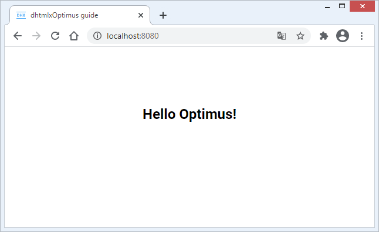

---
sidebar_label: How to start with Optimus
title: How to start with Optimus
---          

This guide gives you step-by-step instructions on how to create a simple application with dhtmlxOptimus.

The guide will teach you how to create your own views on the base of DHTMLX Optimus using dhtmlxSuite. You will also learn how to exchange data between the views and components from any point of the application. 

{{note The complete source code is available on [GitHub](https://github.com/DHTMLX/optimus-demo-guide/tree/master). You can check the step-by-step changes by switching between branches with the related names.}}

For more information about working with the components of the dhtmlxSuite library, see [DHTMLX documentation](https://docs.dhtmlx.com). The detailed information on the DHTMLX Optimus framework is presented [here](optimus_guides/index.md).

Configuring the environment
------------------------

In this tutorial we'll work with the [environment](https://github.com/DHTMLX/optimus-demo-guide/tree/master) that we've already configured using [webpack](https://webpack.js.org). If needed, you can supplement the environment by yourself.

The whole project structure will be as follows:

~~~html
optimus_demo_guide
|── build/
└── src/
   |── ../assets/
   |── static/
   |── views/
   |── index.html
   └── index.js	
~~~

- **root** directory - contains files with configurations of the project and environment
- **build/** folder - contains scripts for running webpack
- **src/** folder - includes sources for the application's functioning
- **src/index.js** - the entry point of the application
- **views/** folder - stores files with views. We recommend to have a single view per file.

To begin with, you should install the dependencies in the *package.json* file with the following command:

~~~js
npm install
~~~

If you need to install "dhx-optimus" into your own project, use the command below:

~~~js
npm i dhx-optimus
~~~

and to install the "dhx-optimus-store" state manager, run the following command:

~~~js
npm i dhx-optimus-store
~~~

{{note DHTMLX Optimus requires the files of the dhtmlxSuite library as dependencies. Thus, you'll need to add js/css files of dhtmlxSuite to provide the correct work of DHTMLX Optimus. In this tutorial we're going to load Suite from CDN. }}

After all dependencies are installed, you can start creating your first app on the base of DHTMLX Optimus.

Step 1. Creating an application
--------------------------------

{{note The full code for this step is available on [GitHub](https://github.com/DHTMLX/optimus-demo-guide/tree/guide/first-step).}}

Let's use the [project structure](https://github.com/DHTMLX/optimus-demo-guide/tree/guide/first-step) that is already defined.

1\. First, create a new *index.html* file in the *src* folder and define a container to render our app there: 

~~~html title="index.html"
<!DOCTYPE html>
<html lang="en">
	<head>
		<title>dhtmlxOptimus guide</title>
	</head>
	<body>
		<!-- Create a container with the unique id -->
		<section id="app" class="main__container"></section>
	</body>
</html>
~~~

2\. Next, you need to create an *index.js* file - the entry point of the app. 

~~~js title="src/index.js"
import "./../assets/css/index.css"; // import css styles
import { App } from "dhx-optimus";

export class MyApp extends App {}
~~~

Here we've created the MyApp class that will render our application. The MyApp class is inherited from the App class included from the "dhx-optimus" library. 

For details about css styles used for the app, see the [index.css](https://github.com/DHTMLX/optimus-demo-guide/blob/guide/first-step/src/../assets/css/index.css) file.

3\. It's time to create our first View. For that, go to the *views* folder and create the *TopLayout.js* file there. 

{{note We recommend that you use the capital letter at the beginning of the name of the file that have a view => TopLayout.js. This is the common practice.}}

~~~js title="src/views/TopLayout.js}"
import { View } from "dhx-optimus";

export class TopLayout extends View {
	init() {
		return `<h1>Hello Optimus!</h1>`;
	}
}
~~~

As you can see, we've created the TopLayout class that is inherited from the View class included from the "dhx-optimus" library. To define the initial view, we've returned an HTML element in the **init()** method. 

4\. Now, you can render the just created view. To do that, include the view into the *index.js* file and render it via the **show()** method:

~~~js title="src/index.js"
import "./../assets/css/index.css";

import { App } from "dhx-optimus";
import { TopLayout } from "./views/TopLayout"; /*!*/

export class MyApp extends App {
	init() { /*!*/
		this.show(null, TopLayout); /*!*/
	} /*!*/
}
~~~

You can find more details on API methods [here](optimus_guides/index.md#api).

5\. Finally, initialize your application. Navigate to the *index.html* file and update its code with the following:

~~~html
<!DOCTYPE html>
<html lang="en">
	<head>
		<title>dhtmlxOptimus guide</title>
		<!-- Suite -->
		
		<link rel="stylesheet" href="https://cdn.dhtmlx.com/suite/edge/suite.css" />
		<!-- App -->
		
		<link rel="stylesheet" href="./app.css" />
	</head>
	<body>
		<section id="app" class="main__container"></section>
		
	</body>
</html>
~~~

Everything is pretty straightforward here:

- include a free version of DHTMLX from our CDN. It is necessary to include files of DHTMLX Suite as  dependencies for correct work of DHTMLX Optimus;
- include the *app.js* and *app.css* files to configure webpack;
- initialize the app via the **render()** method that takes the ID of the container as a parameter.

Now, you can run the application:

~~~js
npm start
~~~

Open *http://localhost:8080/* in your browser. The result should be like this:

