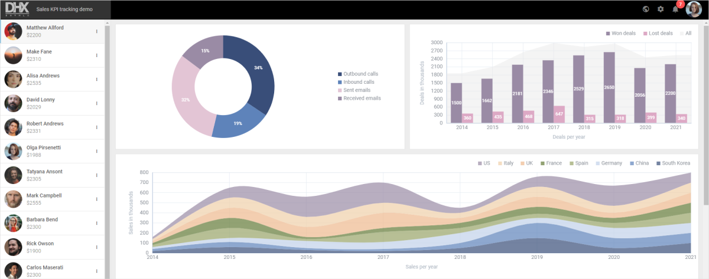

---
sidebar_label: Sales KPI tracking system demo
title: Sales KPI Tracking System Demo
--- 

This demo application shows how to create a Sales KPI tracking system based on the DHTMLX Suite widgets: Layout, List, Toolbar, and Charts.

## How to download

Open the [DHTMLX JavaScript Demos](https://dhtmlx.com/docs/products/demoApps/) page. Have a look at JavaScript demo applications made with DHTMLX. Choose the KPI Tracking System and click on it. Also, you can go directly to the [KPI Tracking System](https://dhtmlx.com/docs/products/demoApps/dhtmlxKPI/) demo page.  

Tip: Use the navigation arrows at the left bottom corner of the page to surf all the demos.

Click the Download Demo button at the right bottom corner.

Complete the form to start the download. The email with the download link will be sent to you.

Follow the link in the email to get a free 30-day trial version. You will receive a .zip file with the KPI tracking demo. Save the file and unpack it to your working directory.

## How to start

Follow the instruction in the README.md file to run the demo. Enjoy a nice and easy to modify solution build on the DHTMLX Optimus framework.

## Demo overview

DHTMLX Chart from the Suite package is the core component of the demo. It provides various types of charts for visualizing complex data. The KPI tracking system is an interactive demo. You can change the parameters and see the results immediately.

The KPI demo is built with the help of the DHTMLX Optimus framework. The components of the demo are divided into Views. You can initialize or modify each component separately. Any component can be removed. The demo can be taken as a View itself and become a component of another app.

The solution you can see has no requirements for the backend. It is based on the REST API and you can use any backend platform which supports it (PHP, Nodejs, .Net, Java, etc.).

## License

A free 30-day trial version is provided only for evaluation purposes. After a trial term is over, you will receive messages about using an unlicensed product.

Learn more about [Evaluation License Terms](https://dhtmlx.com/docs/products/license.shtml?eval). `check`

### How to start with license

If you would like to use this demo in your project after the evaluation period expires, you should purchase the DHTMLX Suite PRO Edition license. You will need to replace the .js and .css files of the evaluation version with the licensed files of DHTMLX Suite to be able to work with the demo after the purchase.

Please have a look at the available [license types](https://dhtmlx.com/docs/products/licenses.shtml) for more information.
