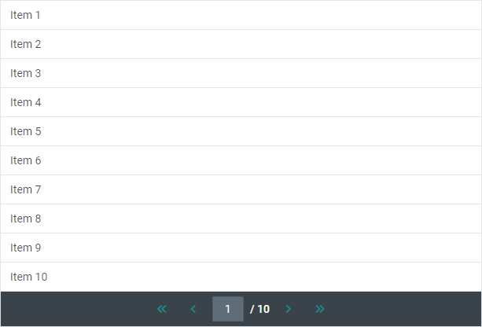

---
sidebar_label: Customization
title: Customization
---          

Styling
----------------

There is a possibility to make changes in the look and feel of a pagination. 

For this you need to take the following steps:

- add a new CSS class(es) with desired settings in the &lt;style&gt; section of your HTML page or in your file with styles (don't forget to include your file on the page in this case):

~~~html

~~~

- specify the name of the created CSS class (or names of classes separated by spaces) as the value of the [css](pagination/api/pagination_css_config.md) property in the Pagination configuration:

~~~js
var pagination = new dhx.Pagination("pagination_container",{
	css:"my_first_class my_second_class"    
});
~~~

For example:

~~~js

const pagination = new dhx.Pagination("pagination_container", {
    css: "dhx_widget--bordered dhx_widget--no-border_top custom_class",
    data: list.data
});
~~~

[Pagination. Custom style](https://snippet.dhtmlx.com/e7bujtsu)
