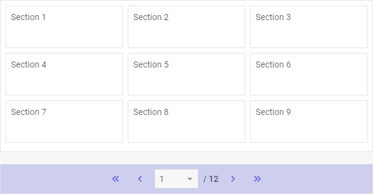

# Pagination overview

{{pronote
The Pagination component is available in the **PRO** version only.
}}

dhtmlxPagination helps to divide large amount of data into groups and display them on discrete pages. 
The component is easy-to-use and provides handy navigation that allows you to quickly jump to a desired page. dhtmlxPagination is available in combination with data components like DataView, List, Grid, Tree, Treegrid. Check [online samples for dhtmlxPagination](https://snippet.dhtmlx.com/all?text=%23pagination).

## API Reference

- 

## Related resources

- You can get dhtmlxPagination as a part of the Suite library by [downloading dhtmlxSuite](https://dhtmlx.com/docs/products/dhtmlxSuite/download.shtml)
- There are also [online samples for dhtmlxPagination](https://snippet.dhtmlx.com/all?text=%23pagination)  

## Guides

Covers the initialization of Pagination on a page and the ways of configuring and operating the component.

- 
- 
- 
- 
- 
