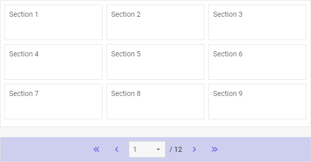

# Pagination overview

{{pronote
The Pagination component is available in the **PRO** version only.
}}

DHTMLX Pagination helps to divide large amount of data into groups and display them on discrete pages.
The component is easy-to-use and provides handy navigation that allows you to quickly jump to a desired page. DHTMLX Pagination is available in combination with data components like DataView, List, Grid, Tree, Grid in the TreeGrid mode. Check [online samples for DHTMLX Pagination](https://snippet.dhtmlx.com/05r4s63b?tag=pagination).

## Features

You can check the following page to learn how to build a full-featured DHTMLX Pagination:

- [Features](/pagination/features/)

## API Reference

- [Pagination API overview](/pagination/api/api_overview/)

## Related resources

- You can get DHTMLX Pagination as a part of the Suite library by [downloading DHTMLX Suite](https://dhtmlx.com/docs/products/dhtmlxSuite/download.shtml)
- There are also [online samples for DHTMLX Pagination](https://snippet.dhtmlx.com/05r4s63b?tag=pagination)

## Guides

Covers the initialization of Pagination on a page and the ways of configuring and operating the component.

- [Initialization](/pagination/init/)
- [Configuration](/pagination/configuration/)
- [Work with Pagination](/pagination/usage/)
- [Customization](/pagination/customization/)
- [Event handling](/pagination/handling_events/)
