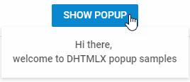

---
sidebar_label: Overview
title: Popup overview
description: DHTMLX Popup is a convenient pop-up window that renders attached to it DHTMLX components or other content on a mouse click.
---          

dhtmlxPopup is a pop-up window that can contain various content. It allows attaching other DHTMLX components and different HTML content. 

Mainly, the component is applied for showing a pop-up content on some action, such as a button click. Check [online samples for dhtmlxPopup](https://docs.dhtmlx.com/suite/samples/popup/).

## API reference

- 

## Related resources

- You can get dhtmlxPopup as a part of the Suite library by [downloading dhtmlxSuite](https://dhtmlx.com/docs/products/dhtmlxSuite/download.shtml)          
- There are also [online samples for dhtmlxPopup](https://docs.dhtmlx.com/suite/samples/popup/) 

## Guides

Guides you through the information about possibilities of working with Popup.

- 
-                    
- 
- 
