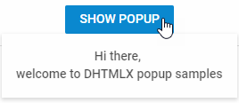

# Popup overview

DHTMLX Popup is a pop-up window that can contain various content. It allows attaching other DHTMLX components and different HTML content.

Mainly, the component is applied for showing a pop-up content on some action, such as a button click. Check [online samples for DHTMLX Popup](https://snippet.dhtmlx.com/bz1ekc71?tag=popup).

## Features

You can check the following page to learn how to build a full-featured DHTMLX Popup:

- [Features](/popup/features/)

## API reference

- [Popup API overview](/popup/api/api_overview/)

## Related resources

- You can get DHTMLX Popup as a part of the Suite library by [downloading DHTMLX Suite](https://dhtmlx.com/docs/products/dhtmlxSuite/download.shtml)
- There are also [online samples for DHTMLX Popup](https://snippet.dhtmlx.com/bz1ekc71?tag=popup)

## Guides

Guides you through the information about possibilities of working with Popup.

- [Initialization](/popup/initialization/)
- [Work with Popup](/popup/work_with_popup/)
- [Customization](/popup/customization/)
- [Event handling](/popup/event_handling/)
