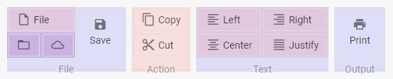

---
sidebar_label: Block
title: Block
---          

The Block control is used for grouping related controls.
 

{{editor	https://snippet.dhtmlx.com/yr8oepq8	Ribbon. Blocks}}

## Creating a Block

This is the basic syntax of a block with two buttons in a row:

~~~js
{
   type: "block",
   title: "Action",        
   items: [
     { id: "copy", icon: "mdi mdi-content-copy", value: "Copy" },
     { id: "cut", icon: "mdi mdi-content-cut", value: "Cut" }
   ]
}
~~~

### Properties

You can provide the [following properties](ribbon/api/api_block_properties.md) in the configuration object of a Block control.

## Adding a Block

A block can be added to a ribbon with the help of the **add()** method of TreeCollection:

~~~js
ribbon.data.add({
    title:"File",
    type:"block",
    id:"files",
    direction:"row"
});
~~~

Controls for this block can be added afterwards with the same method:

~~~js
ribbon.data.add({
    type:"button",
    icon:"dxi dxi-plus",
    value:"New"
},-1,"files");

ribbon.data.add({
    type:"iconButton",
    icon:"dxi dxi-file"
},-1,"files");
~~~

**add()** in this case receives three parameters:

<table class="webixdoc_links">
	<tbody>
        <tr>
			<td class="webixdoc_links0"><b>item</b></td>
			<td>the configuration of the added item</td>
		</tr>
        <tr>
			<td class="webixdoc_links0"><b>index</b></td>
			<td>defines the position of the item in the block (-1 will place it after the last control)</td>
		</tr>
        <tr>
			<td class="webixdoc_links0"><b>blockId</b></td>
			<td>the ID of the block</td>
		</tr>
    </tbody>
</table>

## Adding HTML content

You can add any custom HTML content to an item of the block with the help of the **html** property:

~~~js
{
	type: "block",
	title: "Progress",
	items: [
		{
		    html: "

",
			size: "auto"
		}
	]
};
~~~

{{editor	https://snippet.dhtmlx.com/3djaib6o	Ribbon. Item HTML Content}}

## Nesting blocks

You can add blocks inside blocks to create complex blocks with several rows and columns, e.g.:

~~~js
{
    title:"File",
    type:"block",
    direction:"col", 
    items:[
        {
            type:"block", direction:"row",
            items:[
                { type:"button", icon:"dxi dxi-plus", value:"New" },
                { type:"button", icon:"dxi dxi-file", value:"File" }
            ]
        },
        {
            type:"block", direction:"row",
            items:[
                {
                    type:"imageButton", count:10,
                    src:"../img/avatar4.png"
                },
                {
                    type:"imageButton", value:"Torch",
                    src:"../img/avatar3.png"
                }
            ]
        }
    ]
}
~~~

## Hiding/showing blocks

To hide/show a block, you should pass its ID to the **hide() / show()** methods:

~~~js
ribbon.show(id);
ribbon.hide(id);
~~~

## Disabling/enabling blocks 

A block can be enabled/disabled:

~~~js
ribbon.enable(id);
ribbon.disable(id);
~~~

