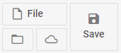

---
sidebar_label: Button
title: Button
---          

This is a simple button that can have an icon. Button can be *twoState* and can have a badge with a number, which can be useful for displaying the number of new messages, etc.

{{editor	https://snippet.dhtmlx.com/nlviu82g	Ribbon. Group Buttons}}

## Creating Buttons

This is the basic syntax of a button:

~~~js
{
    type:"button", value:"Best button"
}
~~~

### Properties

You can provide the [following properties](ribbon/api/api_button_properties.md) in the configuration object of a Button control.

## Adding Buttons

Button can be easily added to a ribbon block with the help of the **add()** method of TreeCollection:

~~~js
ribbon.data.add({
    type:"button", value:"Best button"
},-1,"blockId");
~~~

## Adding HTML content

You can add a custom element to a button with the help of the **html** property:

~~~js
{
    type: "button",
    html: "

",
    size: "auto"
}
~~~

[Ribbon. Item HTML Content](https://snippet.dhtmlx.com/3djaib6o)

## Showing/hiding Button 

To hide/show a button, you should pass the ID of the button to the **hide()/show()** methods:

~~~js
ribbon.show(id);
ribbon.hide(id);
~~~

## Enabling/disabling Button 

Any button in the ribbon can be enabled/disabled:

~~~js
ribbon.enable(id);
ribbon.disable(id);
~~~

## Adding an icon

A button can have an [icon](ribbon/fa_icons.md#icons):

~~~js
{
    type:"button", value:"Done",
    icon:"dxi dxi-check"
}
~~~

## Adding a badge with a number

You can add a number badge to the button to display information like the number of new messages. Set the **count** property:

~~~js
{
    type:"button", value:"Done",
    icon:"dxi dxi-check",
    count:10
}
~~~

{{editor	https://snippet.dhtmlx.com/trli6sq7	Ribbon. Buttons}}

## Styling buttons

You can style Button by adding custom CSS classes in the **css** property:

~~~js
{
    type:"button", value:"Best button", css:"best_button"
}
~~~

Where "best_button" can be a CSS class like this:

~~~html
.best_button{
    background-color:cornflowerblue;
}
.best_button:hover{
    background-color:rgb(183, 199, 228);
}
~~~

## TwoState Buttons

You can create buttons with two states: active (pressed) and inactive (unpressed).

~~~js
{
    type:"button", value:"Select", twoState:true, active:true
}
~~~

### Changing the state of Button

The state of a TwoState button or values of controls can be changed programmatically with the **setState()** method of ribbon:

~~~js
{
    type:"button", twoState:true, value:"Check", id:"check"
}
...
ribbon.setState({check:true});  // active:true
// or
ribbon.setState({check:false});  // active:false
~~~

**setState()** accepts one parameter - a key-value pair with the ID of the button and the new value.

### Accessing the state of Button

The current state of a TwoState button and values of controls can be checked with the **getValues()** method:

~~~js
{
    type:"button", value:"Check", twoState:true, id:"check"
}
...
ribbon.getState();
// { check:true }
// or
// { check:false }
~~~

