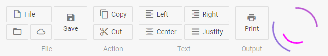

---
sidebar_label: Custom HTML
title: Custom HTML
---          

This is an item that contains any custom HTML content (for example, an image, icon or other element).

{{editor	https://snippet.dhtmlx.com/c0i0q3cu	Ribbon. Custom HTML}}

Adding Custom HTML
-----------------

Any custom HTML content can be easily added to a ribbon with the help of the **add()** method of [Tree Collection](tree_collection/api/refs/treecollection.md):

~~~js
ribbon.data.add({
	type: "customHTML",
	html: "

"
});
~~~

{{editor	https://snippet.dhtmlx.com/c0i0q3cu	Ribbon. Custom HTML}}

### Properties

You can provide the [following properties](ribbon/api/api_customhtml_properties.md) in the configuration object of a Custom HTML control.

Working with Custom HTML
-----------------------

You can perform operations over the **Custom HTML** item with the help of the available [Ribbon API](ribbon/api/refs/ribbon.md) and [Tree Collection API](tree_collection/api/refs/treecollection.md).

