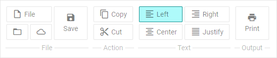

# Customization

## Icons

DHTMLX Ribbon uses the [icons of the DHTMLX library](helpers/icon.md) by default. However, you can use any other icon font pack, if necessary. For this, you need to include the desired icon font on 
a page and apply icons for Ribbon controls.

For example, you can use the [Material Design](https://pictogrammers.com/library/mdi/?welcome) icon pack by including [link to its CDN](https://cdnjs.cloudflare.com/ajax/libs/MaterialDesign-Webfont/2.5.94/css/materialdesignicons.css)
after the source files of DHTMLX Ribbon as follows:

~~~html

<link rel="stylesheet" href="../../codebase/ribbon.css">

<link href="https://cdn.materialdesignicons.com/3.6.95/css/materialdesignicons.min.css?v=6.4.4" 
    media="all" rel="stylesheet" type="text/css">
~~~

Then you can use the name of the icon as the value of the **icon** property in the [object with the control parameters](ribbon/data_loading.md#json-format-templates) for ribbon:

~~~js
const data = [
    {
        type: "block",
        "items": [
            {
                type: "block",
                "items": [
                    {
                        value: "New",
                        icon: "mdi mdi-file-outline",
                        size: "auto",
                    }
                ]
            },
            {
                type: "block",
                direction: "col",
                "items": [
                    {
                        value: "Add",
                        icon: "mdi mdi-plus",
                        size: "small",
                    },
                    {
                        value: "Remove",
                        icon: "mdi mdi-minus",
                        size: "small",
                    }
                ]
            }
        ]
    }
];
~~~

**Related sample**: [Ribbon. Custom icons](https://snippet.dhtmlx.com/sfkou9gp)

{{note You can use the [Font Awesome](https://fontawesome.com/) icon pack by including [link to its CDN](https://docs.fontawesome.com/web/setup/get-started) in the same way.}}

## Styling 

There is a possibility to make changes in the look and feel of a ribbon. 

**Related sample**: [Ribbon. Styling (custom CSS)](https://snippet.dhtmlx.com/9ckg47ro)

For this you need to take the following steps:

- add a new CSS class(es) with desired settings in the &lt;style&gt; section of your HTML page or in your file with styles (don't forget to include your file on the page in this case)

~~~html

~~~

- specify the name of the created CSS class (or names of classes separated by spaces) as the value of the [css](ribbon/api/ribbon_css_config.md) property in the Ribbon configuration:

~~~js
const ribbon = new dhx.Ribbon("ribbon_container", {
    css:"my_first_class my_second_class"
});
~~~

For example:

~~~html

~~~
