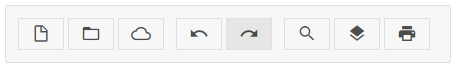

---
sidebar_label: iconButton Control
title: iconButton Control
---  

```tododelete не используется?``` 

```

This is a button with an icon. It does not have a caption unlike ribbon/button.md, but can also have a badge with a number and can be _twoState_.



## Creating IconButton

~~~js
{
    type: "iconButton",
    icon: "dxi-bell-outline"
}
~~~


## Attributes

You can provide the following attributes in the configuration object of iconButton:

- **id** (string|number) - optional, the ID of the button;
- **type** (string) - always "iconButton";
- **icon** (string) - the name of the icon;
- **count** (number|string) - optional, adds a badge with a number or any symbol (badge is round and doesn't expand);
- **$hidden** (boolean) - optional, hides the control;
- **twoState** (boolean) - optional, defines whether the button has two states (active/inactive);
- **active** (boolean) - optional, for two-state buttons, if true, the button is in the active state;
- **css** (string) - optional, adds a custom CSS class.

## Adding IconButtons

IconButton can be easily added to a ribbon with the help of the [add()]() method of TreeCollection:

~~~js
myRibbon.data.add({
    type: "iconButton",
    icon: "dxi-bell-outline"
},-1,"blockId");
~~~

## Working with IconButton

Just like ribbon/button.md, iconButton can be hidden and disabled. You can also manipulate the states of a twoState iconButton.

@todo:
shall I repeat the text from Button about hide, disable, tooltip and twoState, or a simple link (as it is now) will do? no tooltips for ribbon?

```