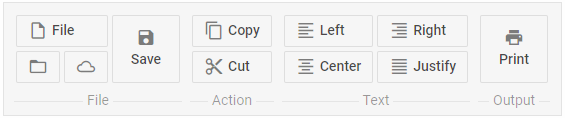

---
sidebar_label: Overview
title: Ribbon overview
description: DHTMLX Ribbon is a highly customizable component that can be used for creating a handy navigation bar by grouping diversity of controls into logical blocks. 
---          

dhtmlxRibbon is an advanced version of dhtmlxToolbar. It aggregates commands and tools used in an application or in a website into logical blocks thus providing a handy navigation bar. 
Check [online samples for dhtmlxRibbon](https://docs.dhtmlx.com/suite/samples/ribbon/).

## API reference

- 

## Related resources

- You can get dhtmlxRibbon as a part of the Suite library by [downloading dhtmlxSuite](https://dhtmlx.com/docs/products/dhtmlxSuite/download.shtml)          
- There are also [online samples for dhtmlxRibbon](https://docs.dhtmlx.com/suite/samples/ribbon/)  

## Guides

### Ribbon Settings

Introduces the steps of creating Ribbon and discusses the ways of customizing and manipulating this component.

- 
- 
-  
-                 
- 
- 

### Ribbon Controls

Includes the overview of main Ribbon controls and their attributes.

- 
- 
-                
-                
- 
- 
- 
- 
- 
