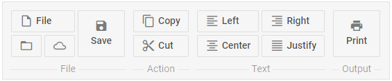

# Ribbon overview

DHTMLX Ribbon is an advanced version of DHTMLX Toolbar. It aggregates commands and tools used in an application or in a website into logical blocks thus providing a handy navigation bar. Check [online samples for DHTMLX Ribbon](https://snippet.dhtmlx.com/3djaib6o?tag=ribbon).

## Features

You can check the following page to learn how to build a full-featured DHTMLX Ribbon:

- [Features](/ribbon/features/)

## API reference

- [Ribbon API overview](/ribbon/api/api_overview/)

## Related resources

- You can get DHTMLX Ribbon as a part of the Suite library by [downloading DHTMLX Suite](https://dhtmlx.com/docs/products/dhtmlxSuite/download.shtml)
- There are also [online samples for DHTMLX Ribbon](https://snippet.dhtmlx.com/3djaib6o?tag=ribbon)
- To work with data of Ribbon check [TreeCollection API](/tree_collection/)

## Guides

### Ribbon settings

Introduces the steps of creating Ribbon and discusses the ways of customizing and manipulating this component.

- [Initialization](/ribbon/how_to_start/)
- [Data loading](/ribbon/data_loading/)
- [Work with Ribbon](/ribbon/operating_ribbon/)
- [Customization](/ribbon/customization/)
- [Event handling](/ribbon/handling_events/)

### Ribbon controls

Includes the overview of main Ribbon controls and their attributes.

- [Block](/ribbon/block/)
- [Button](/ribbon/button/)
- [Custom HTML](/ribbon/customhtmlbutton/)
- [ImageButton](/ribbon/image_button/)
- [Input](/ribbon/input/)
- [SelectButton](/ribbon/selectbutton/)
- [Separator](/ribbon/separator/)
- [Spacer](/ribbon/spacer/)
- [Title](/ribbon/title/)
