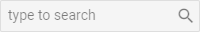

---
sidebar_label: Input
title: Input
---          

A text input field with an icon.

## Adding Input

The following syntax shows how an Input control can be easily added to a ribbon:

~~~js
ribbon.data.add({
	type:"input",
	value:"",
	placeholder:"Type to search"
});
~~~

{{editor	https://snippet.dhtmlx.com/jjnzc3ng	Ribbon. Input}}

### Properties

You can provide the [following properties](ribbon/api/api_input_properties.md) in the configuration object of an Input control.

## Showing/hiding Input 

You can show or hide Input with the methods of Ribbon:

~~~js
ribbon.show(id);
ribbon.hide(id);
~~~

## Enabling/disabling Input

You can also disable and enable inputs:

~~~js
ribbon.enable(id);
ribbon.disable(id);
~~~

## Setting/getting Input value

You can use the **setState()** and **getState()** methods of Ribbon to change and access the value of Input.

To fill in Input with text, call **setState()** with a key-value pair as a parameter, where the key is the ID of the input and the value is the text:

~~~js
{
	type: "input",
	id:"search",
	value: ""
}
...
ribbon.setState({search:"Summer"});
~~~

To get the text that is currently inside the Input control, call **getState()**:

~~~js
ribbon.getState();
// {search:"Summer"}
~~~
