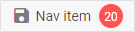

---
sidebar_label: NavItem
title: NavItem
---          

This is a default control for navigation-related components, can contain any other controls as nested items. 

Adding NavItem
----------------

A navItem can be easily added to a ribbon with the help of the **add()** method of Tree Collection:

~~~js
ribbon.data.add({
    type:"navItem", value:"My NavItem"
});
~~~

{{editor	https://snippet.dhtmlx.com/zijc2nta	Ribbon. Nav Items}}

### Properties

You can provide the [following properties](ribbon/api/api_navitem_properties.md) in the configuration object of a NavItem control.

## Adding an icon

A navItem can have an icon which is set through the corresponding option **icon**:

~~~js
{
    type:"navItem", value:"Some",
    icon:"dxi dxi-check"
}
~~~

## Adding a badge with a number

You can add a number badge to the navItem to display information like the number of new messages. The badge is set via the **count** property:

~~~js
{
    type:"navItem", value:"Some",
    icon:"dxi dxi-check",
    count:10
}
~~~

## Adding HTML content

You can add a custom HTML content to a navItem with the help of the **html** property:

~~~js
{
    type: "navItem",
    html: "

",
}
~~~

{{editor	https://snippet.dhtmlx.com/3djaib6o	Ribbon. Item HTML Content}}

## Showing/hiding a navItem

To hide/show a navItem, you should pass the ID of the navItem to the **hide() / show()** Ribbon methods:

~~~js
ribbon.show(id);
ribbon.hide(id);
~~~

## Enabling/disabling a navItem 

Any navItem in the ribbon can be enabled/disabled:

~~~js
ribbon.enable(id);
ribbon.disable(id);
~~~

## Setting tooltip

You can add a tooltip to a navItem:

~~~js
{
    type:"navItem", 
    value:"Click", 
    tooltip:"Click me and find out why"  /*!*/
}
~~~