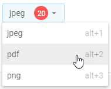

---
sidebar_label: SelectButton
title: SelectButton
---          

This is a button that contains a drop-down list of options.

## Adding SelectButton

A new SelectButton can be created with the help of the **add()** method of Tree Collection:

~~~js
ribbon.data.add({
	id:"select",
	type: "selectButton",
    value: "jpeg",
    size: "small",
    count: 20,
    items: [
    	{
        	value: "jpeg",
            hotkey: "alt+1"
        },
        {
            value: "pdf",
            hotkey: "alt+2"
        },
        {
            value: "png",
            hotkey: "alt+3"
        }
	]
});
~~~

{{editor	https://snippet.dhtmlx.com/5acqc24m	Ribbon. Select Button}}

### Properties

You can provide the [following properties](ribbon/api/api_selectbutton_properties.md) in the configuration object of a SelectButton control.

Operations with a button
-----------------------

You can perform operations over the SelectButton control with the help of the available [Ribbon API](ribbon/api/refs/ribbon.md) and [Tree Collection API](tree_collection/api/refs/treecollection.md).

@todo:
check attrs
