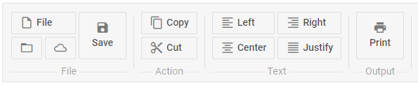

---
sidebar_label: Separator
title: Separator
---          

This is a control that adds a line separating items/groups of items from each other.

## Adding Separator 

A separator can be added between menu options:

~~~js
ribbon.data.add({
    type:"separator"
});
~~~

{{editor	 https://snippet.dhtmlx.com/wqhahyw8	Ribbon. Separator}}

### Properties

You can provide the [following properties](ribbon/api/api_separator_properties.md) in the configuration object of a Separator control.

## Showing/hiding Separator

You can hide and show Separator with the methods of Ribbon:

~~~js
ribbon.showItem(id);
ribbon.hideItem(id);
~~~

