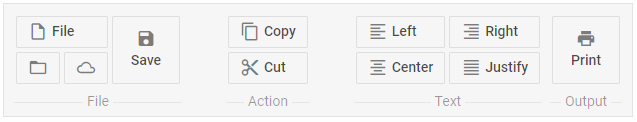

---
sidebar_label: Spacer
title: Spacer
---          

This item takes space on the ribbon and is used for aligning controls.

## Adding Spacer

A new Spacer can be created with the help of the **add()** method of Tree Collection:

~~~js
ribbon.data.add({
	type:"spacer"
});
~~~

{{editor	https://snippet.dhtmlx.com/a8c6y3ob	Ribbon. Spacer}}

### Properties

You can provide the [following properties](ribbon/api/api_spacer_properties.md) in the configuration object of a Spacer control.

## Showing/hiding spacer

You can hide and show Spacer with the methods of ribbon:

~~~js
ribbon.show(id);
ribbon.hide(id);
~~~

