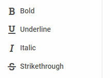
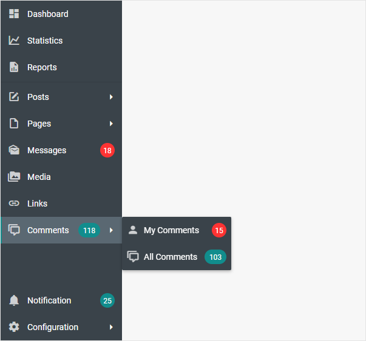

---
sidebar_label: Customization
title: Customization
---          

Icons
------------

dhtmlxSidebar uses the [icons of the DHTMLX library](helpers/icon.md) by default. However, you can use any other icon font pack, if necessary. For this, you need to include the desired icon font on 
a page and apply icons for Sidebar controls.

For example, you can use the [Font Awesome](https://fontawesome.com/) icon pack by including [link to its CDN](https://fontawesome.com/how-to-use/on-the-web/setup/getting-started?using=web-fonts-with-css) 
after the source files of dhtmlxSidebar as follows:

~~~html

<link rel="stylesheet" href="../../codebase/sidebar.css">

<link rel="stylesheet" href="https://use.fontawesome.com/releases/v5.5.0/css/all.css" 
	integrity="sha384-B4dIYHKNBt8Bc12p+WXckhzcICo0wtJAoU8YZTY5qE0Id1GSseTk6S+L3BlXeVIU" 
    crossorigin="anonymous">
~~~

Then you can use the name of the icon as the value of the **icon** property in the [object with the control parameters](sidebar/data_loading.md#jsonformattemplates) for Sidebar:

~~~js
var sidebarData = [
	{
		icon: "fas fa-bold",
		twoState: true,
		value: "Bold"
	},
	{
        icon: "fas fa-underline",
        twoState: true,
        value: "Underline"
    },
    {        
        icon: "fas fa-italic",
        twoState: true,
        value: "Italic"
    },
    {
        icon: "fas fa-strikethrough",
        twoState: true,
        value: "Strikethrough"
    }
];
~~~

{{note You can use the [Material Design](https://materialdesignicons.com/) icon pack by including [link to its CDN](https://cdnjs.cloudflare.com/ajax/libs/MaterialDesign-Webfont/2.5.94/css/materialdesignicons.css) in the same way.}}

Styling 
-----------

There is a possibility to make changes in the look and feel of a sidebar. 

For this you need to take the following steps:

- add a new CSS class(es) with desired settings in the &lt;style&gt; section of your HTML page or in your file with styles (don't forget to include your file on the page in this case)

~~~html

~~~

- specify the name of the created CSS class (or names of classes separated by spaces) as the value of the [css](sidebar/api/sidebar_css_config.md) property in the Sidebar configuration:

~~~js
var sidebar = new dhx.Sidebar({
    css:"my_first_class my_second_class"
});
~~~

{{editor	https://snippet.dhtmlx.com/3mhhvvcr	Sidebar. Custom Css}}

