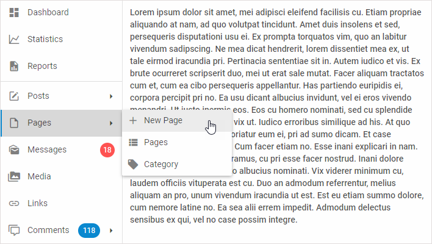

---
sidebar_label: Overview
title: Sidebar overview
description: dhtmlxSidebar is a flexible tool for creating a comfy vertical navigation menu. Advanced API allows easily configuring and combining its various controls.
---          

dhtmlxSidebar is a component that provides means for comfy vertical navigation. Sidebar can contain any Toolbar controls that can be controlled via a handy API.
Check [online samples for dhtmlxSidebar](https://docs.dhtmlx.com/suite/samples/sidebar/).  

## API reference

- 

## Related resources

- You can get dhtmlxSidebar as a part of the Suite library by [downloading dhtmlxSuite](https://dhtmlx.com/docs/products/dhtmlxSuite/download.shtml)          
- There are also [online samples for dhtmlxSidebar](https://docs.dhtmlx.com/suite/samples/sidebar/)  

## Guides

### Sidebar Settings

Tells about creation of Sidebar and shows all available ways of data loading, configuring and styling the component, and working with controls.

- 
- controls:
- - 
- - 
- - 
- - 
- - 
- - 
- 
-                    
- 
- 
- 

### Sidebar Controls

Dwells on the creation of Sidebar controls and the possibilities of manipulating them.
              	
-                                                            
- 
-  
-  
-                   
           